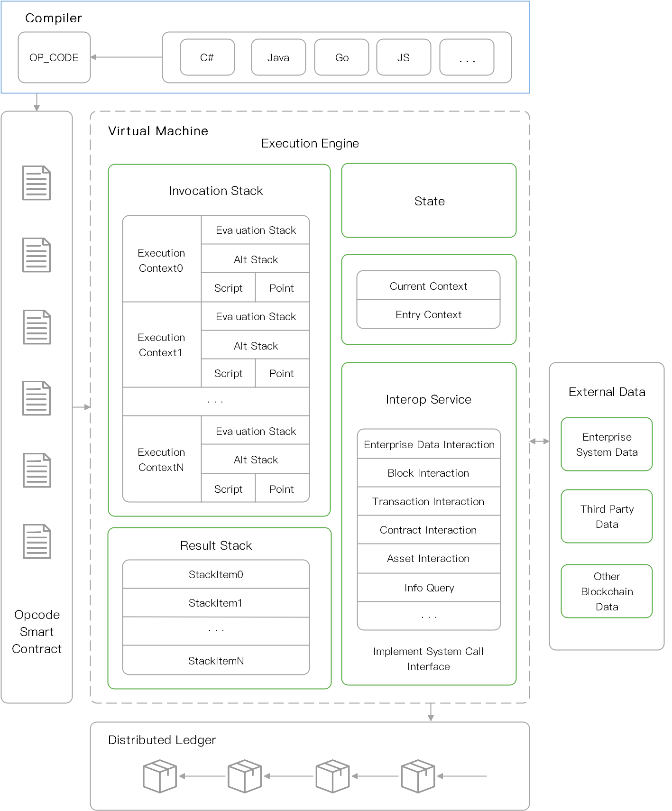

# BHP 虚拟机（BhpVM）

## 简介 

BhpVM 是一个用于执行 BHP 智能合约的轻量级虚拟机。 作为 BHP 的核心组件，BhpVM 具备图灵完备性以及高一致性，可以实现任意执行 逻辑和保证在分布式网络中任意节点执行结果一致，为去中心化应用提供有力支撑。 

同时结合 BhpCompiler 编译器技术，可将 Java、C# 等高级语言编译为统一的 BhpVM 指令集，从而实现跨平台，并使得智能合约的开发者无需学习新的开发语言， 就可参与开发 Bhp 生态应用，降低了开发门槛。 

此外，BhpVM 使用互操作等技术，与上层代码高度解耦和可定制化。使用简便， 仅需创建一个对象，可用于多种不同区块链和非区块链场景。 

## 基础架构和执行流程 

### 基础架构 

BHP 虚拟机 (BhpVM) 的系统架构，主要由执行引擎、栈、互操作接口等部分构成。 

#### 执行引擎

执行引擎(ExecutionEngine)是 BhpVM 的核心，主要由其加载智能合约脚本并执行 相应的指令，例如流程控制、栈操作、位操作、算数运算、逻辑运算、密码学方法等， 还可以通过系统调用互操作服务层接口与外部数据进行交互。 

#### 栈 

BhpVM 是基于栈的虚拟机。其内部共有四种类型的栈，分别是调用栈 (InvocationStack)、计算栈 (EvaluationStack)、临时栈 (AltStack) 和结果栈 (ReaultStack)。 

- 调用栈，用于保存当前虚拟机的所有执行上下文(ExecutionContext)，不同的上下文之 间实现栈隔离。上下文切换依靠当前上下文（CurrentContext）和入口上下文 （EntryContext）来完成。其中当前上下文指向调用栈的栈顶元素，在系统架构图中 对应 ExecutionContext0，入口上下文指向调用栈的栈底元素，在图中对应 ExecutionContextN。 
- 计算栈，用于保存指令在相应执行过程中所用到的数据，每个执行上下文都有自己独立的计算栈。 
- 临时栈，用于保存指令在相应执行过程中所用到的临时数据，每个执行上下文都有自己独立的临时栈。 
- 结果栈，保存所有脚本执行完后产生的执行结果。 

#### 互操作服务层接口 

互操作服务层接口是 VM 与外部数据交互的桥梁。通过调用互操作服务层接口， BhpVM 可以访问智能合约执行时所需要的区块信息、交易信息、合约信息、资产信息 等数据。 

Bhp 的每个智能合约在创建的时候都可以自行选择是否启用一个私有存储区，该存 储区以 key-value 形式存储数据。BhpVM 借助互操作服务接口可以在智能合约执行时 动态修改存储区中相应的数据。 

同时，Bhp 的互操作服务接口还提供了一系列加密算法，零知识证明以及网络资源 访问等功能，以满足开发者构建高级应用的需求。 

此外，互操作服务层接口还支持自定义扩展和修改，满足开发者的定制化需求。  

### 执行流程 

Bhp 支持多语种开发智能合约。编译器会将多语言版本的智能合约编译成统一的 avm 字节码文件，再由 BhpVM 完成相应的译码、执行工作。借助多语言版本的编译器 和虚拟机，实现跨平台的兼容。 

其完整的运行流程如下： 

1. 将编写好的 C#、Java 等智能合约源码通过相应的编译器编译成统一的字节码文件。

2. BhpVM 执行引擎加载字节码文件，并将文件中的字节码以及相关参数等作为一个运行上下文压入虚拟机执行引擎的调用栈中。 
3. BhpVM 执行引擎每次会根据当前上下文取出需要执行的操作码，然后针对不同的操作码去执行对应的操作。执行过程的数据会存储在当前上下文的计算栈和临时栈中。

4. 若需执行外部数据访问、数据加密、零知识证明等操作，则调用互操作接口。 
5. 所有脚本执行完后，将运行结果保存在结果栈中。 