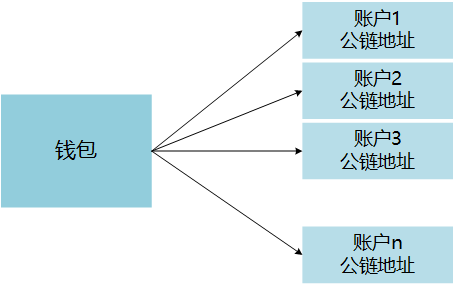

# 使用 BHP-CLI 客户端 

BHP-CLI 作为客户端，在 P2P 网络中充当一个普通节点，同时，该程序也是一个跨平台的钱包，处理各种资产的相关交易。

## BHP-CLI 安全策略 

> #### 警告
>
> 交易所必须使用白名单或防火墙以屏蔽外部服务器请求，否则会有重大安全隐患。

BHP-CLI 本身不提供远程开关钱包功能，打开钱包时也没有验证过程。因此，安全策略由交易所根据自身情况制定。由于钱包要一直保持打开状态以便处理用户的提现，因此，从安全角度考虑，钱包必须运行在独立的服务器上，并参考下表配置好端口防火墙。

|           | Mainnet | Testnet |
| --------- | ------- | ------- |
| JSON-RPC  | 20557   | 20557   |
| P2P       | 20555   | 20555   |
| websocket | 20556   | 20556   |

## 关于 BHP-CLI

BHP-CLI 是为开发者提供的命令行客户端，开发者可以通过两种方式与之交互：

- 使用 CLI（命令行界面）的命令，如创建钱包，创建地址等。
- 通过程序的 RPC 请求，如向指定地址转账，获得指定高度的区块信息，获得指定的交易等。

BHP-CLI 提供以下功能：

- 作为命令行钱包，管理资产。

  要启动钱包，在 bhp-cli 程序目录下输入以下命令：

  ```
  dotnet bhp-cli.dll 
  ```

  要查看所有命令，在 bhp-cli 程序目录下输入以下命令：

  ```
  help 
  ```

  更多信息，请参阅 [CLI 命令参考 ](../node/cli/cli.md)。

- 提供一系列 API 接口，用于从节点获取区块链数据。接口通过 [JSON-RPC](http://www.jsonrpc.org/specification) 的方式提供，底层使用 HTTP/HTTPS 协议进行通讯。

  如果想启动节点的同时开启 API，在 bhp-cli 程序目录下输入以下命令 (如果需要 applicationglogs, 在启动时必须添加下面的引数)：

  ```
  dotnet bhp-cli.dll --rpc 
  ```

  要查看更多 API 信息，请参阅 [API 参考 ](../reference/rpc/api.md)。

- 提供BRC20 资产的交易信息。

- 功能列表

  | #    | 步骤                                 | 输入命令                  |
  | ---- | :----------------------------------- | ------------------------- |
  | 1    | 运行客户端                           | `dotnet bhp-cli.dll`      |
  | 2    | 打开 RPC 接口，记录BRC6 资产交易信息 | `--rpc` 或 `-r` 或 `/rpc` |

  > 功能可叠加，例如需要以上所有功能都开启，那么输入命令： `dotnet bhp-cli.dll --rpc --nopeers`

## 创建钱包 

交易所需要创建一个在线钱包管理用户充值地址。钱包用来存储账户（包含公钥和私钥）、合约地址等信息，是用户持有资产的最重要的凭证，一定要保管好钱包文件和钱包密码，不要丢失或泄露。 交易所不需要为每个地址创建一个钱包文件，通常一个钱包文件可以存储用户所有充值地址。也可以使用一个冷钱包（离线钱包）作为更安全的存储方式。



> BHP-CLI 钱包支持两种格式的钱包， sqlite 钱包（格式为 .db3）和 BRC6 标准 钱包（格式为 .json）。建议交易所使用 sqlite 钱包。

请按照以下步骤创建钱包：

1. 输入命令 `create wallet <path>` 。

   其中 <path> 为钱包路径及名称，扩展名根据所使用的钱包种类来设定，可以是 .db3 也可以是 .json（如无扩展名，则钱包格式为 BRC6 钱包）。如 create wallet /home/mywallet.db3。

2. 设置钱包密码。

## 生成充值地址 

一个钱包可以存储多个地址，交易所需要为每个用户生成一个充值地址。

充值地址有两种生成方式：

- 用户第一次充值（BHP/BHP GAS）时，程序动态创建 BHP 地址，优点：无需人工定期创建地址；缺点：不方便备份钱包。

  要动态创建地址，可以使用 BHP-CLI API 的 `getnewaddress`方法 实现。程序会返回创建的地址。

  ```
  请求正文：
  {
    "jsonrpc": "2.0",
    "method": "getnewaddress",
    "params": [],
    "id": 1
  }
  响应正文：
  {
      "jsonrpc": "2.0",
      "id": 1,
      "result": "AVHcdW3FGKbPWGHNhkPjgVgi4GGndiCxdo"
  }
  响应说明：返回新创建的地址
  ```

- 交易所提前创建一批 BHP 地址，并在用户第一次充值（BHP/BHP GAS）时，给用户分配一个 BHP 地址。优点：方便备份钱包；缺点：当地址不足时需要人工创建 BHP 地址。

  要批量创建地址，执行 BHP- CLI 的 create address [n] 命令，地址会自动导出到 address.txt 文件。 方括号为可选参数，默认值为 1。例如要一次创建 100 个地址，输入 `create address 100` 。
  
  ```
  bhp>create address 100
  ```

> 无论采用哪种方式，交易所需要将生成的地址导入到数据库中，作为充值地址分配给用户。一般建议交易所采用第二种方式，这样可以减少外界对钱包的操作，有利于钱包的稳定运行。

## 导出地址信息

### exportaddresswif

获取指定地址的信息

> [!Note] 执行此命令前需要在 Bhp-CLI 节点中打开钱包。

#### 参数说明

- address：要转账的地址，该地址需为标准地址。

#### 调用示例

请求正文：

```
{
  "jsonrpc": "2.0",
  "method": "exportaddresswif",
  "params": ["AFn2VfsXCC77qRgwAHUtU6oDgFktVoXfSj"],
  "id": 1
}
```

响应正文：

```
{
    "jsonrpc": "2.0",
    "id": 1,
    "result": {
        "wif": "L171n9yN****************5st9NyLa9",
        "prikey": "73e79292*************27b5ec",
        "pubkey": "02023ceab8b8388bab78637dd1492d51eb00cae0bc3c1b770b365d33dd1003e952",
        "address": "AFn2VfsXCC77qRgwAHUtU6oDgFktVoXfSj"
    }
}
```

响应说明：

- wif：该标准地址私钥的WIF格式
- prikey：该标准地址的私钥
- pubkey：该标准地址的公钥
- address：该标准地址的私钥

### 定时导出钱包内所有地址信息

在启动 BHP-CLI 前需先配置 config.json 文件中的以下参数：

- ExportWallet：可选。可以设置定时导出钱包的相关信息。Path 是导出的文件路径如"D:\Wallet"，Interval 是导出间隔时长，默认为8，单位小时，IsActive 设置为 true 将开启自动导出功能。

下面是一个标准设置的例子。

```
{
 ...
    "ExportWallet": {
      "Path": "",
      "Interval": 8,
      "IsActive": false
    }
  }
}
```

## 解锁钱包

### unlock

将钱包解锁指定时长，单位秒。

> [!Note] 执行此命令前需要在 Bhp-CLI 节点中打开钱包。

#### 参数说明

- password：打开钱包的密码。
- seconds ：解锁钱包的秒数，600=10分钟。

#### 调用示例

请求正文：

```
{
  "jsonrpc": "2.0",
  "method": "unlock",
  "params": ["your password", 60],
  "id": 1
}
```

响应正文：

```
{
    "jsonrpc": "2.0",
    "id": 1,
    "result": "true"
}
```

## 转账到冷钱包

### sendtocold

将钱包内的资产转账到指定地址。

> [!Note] 执行此命令前需要在 Bhp-CLI 节点中打开钱包。

#### 参数说明

- address：要转账的地址，该地址需为标准地址。
- asset：资产 ID（资产标识符），即该资产在注册时的 RegistTransaction 的交易 ID。其余资产 ID 可以通过CLI命令中的 llist asset 命令查询，也可以在区块链浏览器中查询。默认为BHP资产。

#### 调用示例

请求正文：

```
{
  "jsonrpc": "2.0",
  "method": "sendtocold",
  "params": ["ATe3wDE9MPQXZuvhgPREdQNYkiCBF7JShY","0x13f76fabfe19f3ec7fd54d63179a156bafc44afc53a7f07a7a15f6724c0aa854"],
  "id": 1
}
```

响应正文：

```
{
    "jsonrpc": "2.0",
    "id": 1,
    "result": {
        "txid": "0x710fb7293cc4b883d94775ff9f847bf81b60f331abe3cfe48ee8544c22583458",
        "size": 440,
        "type": "ContractTransaction",
        "version": 0,
        "attributes": [],
        "vin": [
            {
                "txid": "0xaaa08061003c718bda8d9a236969cbeb9061be9e166b94977996e1320ff54c6c",
                "vout": 1
            },
            {
                "txid": "0x17b088ea29056fb8b7030bd694a5cf84772d4d93b61d2b4e3e4f25f6d4387ed3",
                "vout": 0
            },
           ...
        ],
        "vout": [
            {
                "n": 0,
                "asset": "0x13f76fabfe19f3ec7fd54d63179a156bafc44afc53a7f07a7a15f6724c0aa854",
                "value": "45747516.63541171",
                "address": "ATe3wDE9MPQXZuvhgPREdQNYkiCBF7JShY"
            }
        ],
        "sys_fee": "0",
        "net_fee": "0",
        "tx_fee": "0.0001",
        "scripts": [
            {
                "invocation": "407ea498941f7cf041a68a16ad92292c879fa3dcfc49ac082f19f9bfea8190aa69959e33a3566db9c4cec10c78ed6eba85a247261b55b8fe842b78ebb7463cc0b3",
                "verification": "2103855b6f0f748072d0cedaf048e7d0d6cc4ce705d9e7940cbf290e59fd5ec13aa4ac"
            }
        ]
    }
}
```