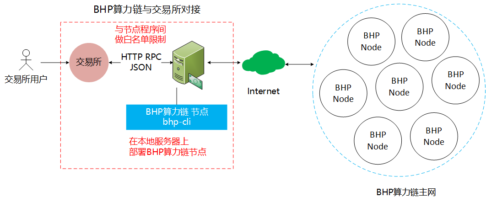

# 在服务器中部署 BHP 节点 

交易所需要在本地服务器上部署钱包节点：bhp-cli，交易所必须使用白名单或防火墙以屏蔽外部服务器请求，否则会有重大安全隐患。交易所与BHP算力公链对接拓扑图：



## 安装节点 

1. 安装 BHP 节点的运行环境

   - Linux(ubuntu 16.04/ubuntu 17.10)，安装 [.NET Core Runtime](https://www.microsoft.com/net/download/core#/runtime) ，2.0 或以上版本
   - windows 10/ windows server，安装 [.NET Core2.0](https://dotnet.microsoft.com/download) 和 [.NET Framework4.7](https://dotnet.microsoft.com/download).

2. 在 GitHub 上下载 [bhp-cli](https://github.com/BhpAlpha/bhp-cli/releases) 程序包并启动 BHP 节点。

   - 对于 Linux 系统，需要安装 LevelDB 和 SQLite3 开发包。例如，在 ubuntu 17.10 上输入以下命令：

   ```
   Ubuntu:
   sudo apt-get install libleveldb-dev sqlite3 -dev libunwind8-dev
   
   Centos:
   sudo yum install leveldb-devel sqlite-devel
   ```

   - 对于 Windows 系统，bhp-cli 的安装包中已经包含了 LevelDB，可跳过第2步。
   - Windows系统可使用 [bhp-gui](https://github.com/BhpAlpha/bhp-gui/releases) ，进行手工转账。GUI程序支持64位的Win10，且必须安装 [.NET Framework4.7](https://www.microsoft.com/net/download) 。

## 安装插件 

交易所需要安装以下[插件](https://github.com/BhpAlpha/bhp-plugins/releases)，以保证 API 的正常使用和自动读取离线包的完整性：

- ApplicationLogs
- ImportBlocks
- RpcSecurity
- SimplePolicy
- StatesDumper

在 bhp-cli 根目录新建 Plugins 文件夹（注意首字母大写），然后将解压出来的插件拷贝到其中。


> - ApplicationLogs 插件需在初始同步之前就必须安装，否则会遗漏安装前已同步区块中交易日志的内容。

## 修改配置文件 

在启动 BHP-CLI 前需先配置 config.json 文件中的以下参数：

- BindAddress：默认为本地 127.0.0.1。可以绑定指定网卡的 ipv4 地址以允许远程调用 rpc。若没有指定对象，则可以设成 0.0.0.0。
- UnlockWallet：可选。可以设置开启自动绑定并打开钱包的功能。Path 是钱包的路径， Password 是钱包的密码， StartConsensus 设为true将开启共识， IsActive 设为 true 意味着允许自动打开钱包， AutoLock 设为 true 将自动给钱包加锁，钱包加锁后，要使用与钱包有关的RPC接口时，需要调用unlock功能。
- ExportWallet：可选。可以设置定时导出钱包的相关信息。Path 是导出的文件路径，Interval 是导出间隔时长，默认为8，单位小时，IsActive 设置为 true 将开启自动导出功能。

下面是一个标准设置的例子。

```
{
  "ApplicationConfiguration": {
    "Paths": {
      "Chain": "Chain_{0}",
      "Index": "Index_{0}"
    },
    "P2P": {
      "Port": 20555,
      "WsPort": 20556
    },
    "RPC": {
      "BindAddress": "127.0.0.1",
      "Port": 20557,
      "SslCert": "",
      "SslCertPassword": ""
    },
    "UnlockWallet": {
      "Path": "",
      "Password": "",
      "StartConsensus": false,
      "IsActive": false,
      "AutoLock": false
    },
    "PluginURL": "",
    "DataRPC": {
      "Host": "http://exp.bhpa.io:7070"
    },
    "ExportWallet": {
      "Path": "",
      "Interval": 8,
      "IsActive": false
    }
  }
}
```

> - 如需使用自动打开钱包的功能，可以在 UnlockWallet 一栏填入 "Path" 如 "1.json" 和 "Password" 如 "123456"，并将 "IsActive" 设为 true.
> - 注意 "Password" 为明文 , 请确保防火墙打开并处于安全环境 , 请谨慎使用。
> - 如需使用钱包自动导出功能，可以在 ExportWallet 一栏填入"Path"如"D:\Wallet"和"Interval"如"12"，并将"IsActive"设置为 true.

| 项目                      | 正式网                | 测试网                                        |
| ------------------------- | --------------------- | --------------------------------------------- |
| 协议配置文件protocol.json | protocol.mainnet.json | protocol.testnet.json                         |
| 区块链浏览器              | https://exp.bhpa.io   | https://texp.bhpa.io (https://47.103.46.191/) |

