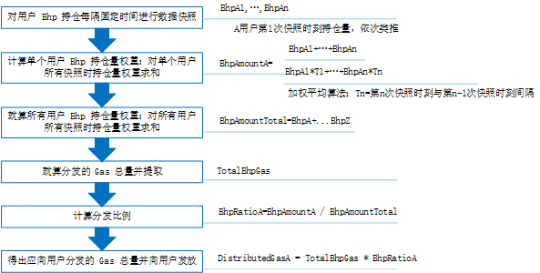

# 给用户分发 GAS

交易所可以选择是否给用户分发 GAS。GAS 用来支付 BHP 区块链的记账费和附加服务费。

## 什么是 GAS ?

BHPGAS（缩写符号 GAS）共 1 亿份，代表了 BHP 区块链的使用权。GAS 会随着每个新区块的生成而产生，依照既定的缓慢衰减的发行速度，经历总量从 0 到 1 亿的过程，约 22 年达到 1 亿总量。只要获得 BHP，GAS 便会在系统中按照算法自动生成。

每一个 BHP 都有两种状态：unspent 和 spent。每一个 GAS 也有两种状态，unavailable 和 available。一个 BHP 的生命周期以转入地址起始，转出地址截止，转入时状态变为 unspent，转出时状态变为 spent。当 BHP 处于 unspent 状态时，所产生的 GAS 为 unavailable 状态，即不可提取。当 BHP 处于 spent 状态时，期间所产生的 GAS 变为 available，用户可以提取。

## 计算可提取的 GAS 总量 

- 可提取的 *GAS = f(neoamount, Δtconst)*

  - Δt*const = t*end - t_start
  - t_end =BHP 变为 spent 状态时刻
  - t_start =BHP 变为 unspent 状态时刻

  由于 Δt 是定量，所以可提取的 GAS 也是一个定量。可提取 GAS 的大小取决于所持有的 BHP 数量以及两个状态的时间差。

- 不可提取的 *GAS = f(neoamount, Δtvar)*

  - Δt*var = t - t*start
  - t 为当前时刻
  - t_start =BHP 变为 unspent 状态时刻

  由于 t 是变量，所以不可提取的 GAS 也随时间增长而不停增长，是一个变量。

## 给用户分发 GAS

假设交易所的所有地址都在一个钱包里，下图显示了交易所向某用户 A 分发 GAS 的流程和计算公式：

快照间隔越短，计算越精确。如果快照时间间隔不均匀，可以采用加权平均算法。

## RPC 方法 

以下 RPC 方法可以帮助交易所查询用户 GAS 信息。要查看调用的 JSON 文件示例，点击表格中的链接。

| 方法     | 描述                                 | 参数 |
| -------- | ------------------------------------ | ---- |
| showgas  | 返回本钱包所有可用和不可用的GAS      |      |
| claimgas | 提取钱包中的 GAS到钱包第一个标准地址 |      |

## 用户提取 GAS

用户将地址中的 BHP 完成一次转账即可提取 GAS，例如：地址 A 中有 BHP，GAS 为不可提取状态， 那么只需要将 BHP 转给自己，GAS 即可变为可提取状态。

具体提取步骤和命令请参见下表。

| #    | 步骤                                                         | 输入命令                                        |
| ---- | :----------------------------------------------------------- | ----------------------------------------------- |
| 1    | 运行客户端                                                   | `dotnet bhp-cli.dll --rpc`                      |
| 2    | 查看客户端版本                                               | `version`                                       |
| 3    | 查看客户端同步高度（Height: 区块高度 / 区块头高度，Nodes: 连接节点数量）。 | `show state`                                    |
| 4    | 创建钱包                                                     | `create wallet /wallets/test.db3`               |
| 5    | 打开钱包                                                     | `open wallet /wallets/test.db3`                 |
| 6    | 查看钱包里的地址列表                                         | `list address`                                  |
| 7    | 查看钱包资产                                                 | `list asset`                                    |
| 8    | 获取钱包 GAS 余额详情                                        | `show gas`                                      |
| 9    | 给自己的钱包地址 （如 AaAHt6Xi51iMCaDaYoDFTFLnGbBN1m75SM 1）转账，通过给自己转账将 GAS 状态变为可提取状态 | `send BHP AaAHt6Xi51iMCaDaYoDFTFLnGbBN1m75SM 1` |
| 10   | 再次获取钱包 GAS 余额详情，此时所有 GAS 都为可提取状态       | `show GAS`                                      |
| 11   | 提取 GAS                                                     | `claim gas [all]`                               |
| 12   | 再次查看钱包余额，确认提取成功                               | `list asset`                                    |