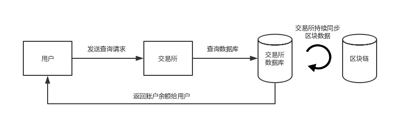
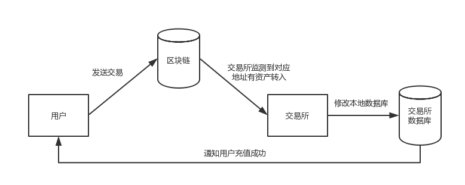
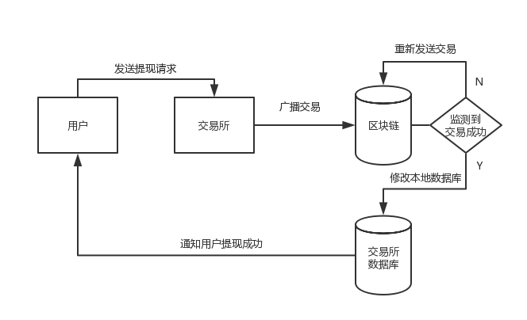

# 处理资产交易 

## 简介 

BHP 中主要有两种资产，一种是全局资产，例如：BHP、GAS 等，使用 UTXO 模型来管理资产。另一种是合约资产，例如：BRC-20 类型的资产，使用 BALANCE 模型来管理资产。交易所对接时，主要处理这两种类型资产的查询、充值、提现等操作。这三种操作的流程分别如下图所示：







## 网络手续费 

使用 BHP 区块链时需要花费网络手续费。收取手续费的根本目的是为了阻止恶意交易与网络攻击，在当前机制下，对于普通用户的正常交易一般不会造成额外手续费的负担。默认收费规则如下：

| 交易类型                           | 交易大小 (byte） | 手续费 (GAS)             |
| ---------------------------------- | ---------------- | ------------------------ |
| 除 ClaimTransaction 以外的所有交易 | <= 102400        | 0                        |
|                                    | > 102400         | 交易大小×0.00001 + 0.001 |
| ClaimTransaction                   | 所有             | 0                        |

> 如果交易所使用 send 命令发送交易到用户地址时自定义了手续费，则只收取两项手续费中价格较高者。

## 处理全局资产交易 

### 查询 

一般来讲，交易所充值地址里的余额并不等于用户在交易所里的余额，有以下原因：

- 在转账或提现时，BHP 钱包会从一个或多个地址中找到即能满足需求又使用总输入最小的零钱作为本次交易的输入，而不会将指定地址的零钱作为交易输入（除非交易所重写了 BHP 钱包的部分代码使其满足自身需求）。
- 其他操作，例如交易所将一部分资产转移到交易所的冷钱包等。

所以交易所由于自身管理钱包产生的查询地址余额需求和用户的查询账户余额请求是不同的。

#### 交易所查询用户地址余额 

要查询用户地址全局资产余额，交易所需要调用 `getaccountstate` API 获取用户地址余额。

##### getaccountstate

在 JSON 文件中，getaccountstate 的请求正文通常为以下格式：

```
{
  "jsonrpc": "2.0",
  "method": "getaccountstate",
  "params": ["AJQ6mhziuS5nYMTBVcu3egXkYtkYsKgcwZ"],
  "id": 1
}
```

params 参数中填写的是用户地址。

发送请求后，将收到如下响应：

```
{
    "jsonrpc": "2.0",
    "id": 1,
    "result": {
        "version": 0,
        "script_hash": "0xce3005fe8f20bf857752242d74604abd8a2eca1c",
        "frozen": false,
        "votes": [],
        "balances": [{
         "asset": "0x13f76fabfe19f3ec7fd54d63179a156bafc44afc53a7f07a7a15f6724c0aa854",
         "value": "45747516.02098971"
        }]
    }
}
```

返回值 "asset" 对应资产 ID ，value 对应资产金额。

#### 处理用户查询账户余额请求 

用户实际在交易所里的余额，应当记录在交易所的数据库里。 交易所需要写代码监控每个区块的每个交易，在数据库中记录下所有充值提现交易，对应修改数据库中的用户余额。

### 充值 

关于用户充值，交易所需要了解以下内容：

- BHP 区块链只有一条主链，没有侧链，不会分叉，也不会有孤立区块。
- 所有记录在 BHP 区块链中的交易都是不可篡改的，即一个确认就代表充值成功。
- BHP 地址中不仅包含 BHP 和 BHP GAS 两种资产，还可以有许多种用户自己发行的全局资产（如股权、Token 等），交易所记录用户充值时需要判断充值资产的资产类型，以免把其它资产的充值当成 BHP 或 GAS，或把 BHP 和 GAS 的充值弄混。
- BHP 钱包是一个全节点，要保持在线才能同步区块，可以通过 BHP-CLI 的 show state 命令查看区块同步状态，例如 ,

```
bhp>show state 
Height: 99/99/99, Nodes: 10 
```

含义为：钱包高度 99/ 区块高度 99/ 区块头高度 99，连接节点数为 10.

> 假设该节点与 P2P 网络充分连接，当区块高度 = 区块头高度时，代表节点同步完成。当钱包高度 = 区块高度 = 区块头高度时，代表节点同步完成且钱包索引建立完成。

- 交易所内的用户之间转账不需要通过区块链，而可以直接修改数据库中的用户余额进行，只有充值提现才上链。


#### 充值记录 

交易所需要写代码监控每个区块的每个交易，在数据库中记录下所有充值提现交易。如果有充值交易就要修改数据库中的用户余额。

BHP-CLI API 中的 `getblock < index> [verbose]` 方法提供了获取区块信息的功能，该方法中的 < index> 为区块索引。[verbose] 默认值为 0，表示返回的是区块序列化后的信息，用 16 进制字符串表示，如果从中获取详细信息需要反序列化。[verbose] 为 1 时返回的是对应区块的详细信息，用 Json 格式字符串表示。更多信息请参阅 [getblock](https://github.com/BhpAlpha/docs/blob/master/cli/1.2.0.8/api/getblock2.md) 方法 。

BHP-CLI API 中的 `listsinceblock <start_height> [target_confirmations]` 方法提供了获取钱包相关交易信息的功能，该方法中的 <start_height> 为开始查询交易的区块高度（包含该高度），[target_confirmations] 默认值为6，表示目标确认数。更多信息请参阅 [listsinceblock](https://github.com/BhpAlpha/docs/blob/master/cli/1.2.0.8/api/listsinceblock.md) 方法。

获取的区块信息中包含了交易输入和交易输出，交易所需要记录下所有和自己相关的交易，作为用户充值提现的交易记录。如果发现在交易的输出中有属于交易所的地址，则要修改数据库中该充值地址对应的用户 BHP 或 GAS 余额。

也有交易所采用另一种方式：如果发现在交易的输出中有属于交易所的地址，先在数据库中记录下充值记录，待几个确认后再修改用户余额。如果不是为了与其它区块链操作方式统一，并不推荐这么做。

> - getblockcount 返回的是主链中的区块数量，getblock < index> 第一个参数是区块索引，区块索引 = 区块高度 = 区块数量 - 1，所以如果 getblockcount 返回 1234，调用 getblock 1234 将获取不到结果，而应该调用 getblock 1233。
> - 交易所充值提现交易的交易类型可以是 InvocationTransaction, 也可以是 ContractTransaction（无论是充值 BHP 还是 GAS），交易所在遍历区块中的所有交易时，只需关心每笔交易的 vout 是否有值。
> - 每个区块的第一个交易必定是 MinerTransaction，在遍历交易时可以忽略或跳过。
> - BHP 系统中的一切事务都以交易为单位进行记录。

### 提现 

关于用户提现，交易所需要完成以下操作：

1. 在 BHP-CLI 中，执行 `open wallet <path>` 命令打开钱包。

2. 记录用户提现，修改用户账户余额。

3. （可选）客服处理提现申请。

4. 使用 BHP-CLI API 中的 `sendtoaddress <asset_id> <address> <value> [fee=0] [change_address] `方法 ，向用户提现地址发送交易。更多信息，请参阅 [sendtoaddress](https://github.com/BhpAlpha/docs/blob/master/cli/1.2.0.11/api/sendtoaddress.md) 方法 。

   - asset_id：资产 ID（资产标识符），即该资产在注册时的 RegistTransaction 的交易 ID。其余资产 ID 可以通过 CLI 命令 中的 list asset 命令查询，也可以在区块链浏览器中查询。

   - address：收款地址
   - value：转账金额。
   - fee：手续费，可选参数，默认为 0。
   - change_address ：找零地址，可选参数，默认为钱包中第一个标准地址。

   要向多个地址批量发送交易，可以使用 API [sendmany](https://github.com/BhpAlpha/docs/tree/master/rpc/1.2.0.11/api/sendmany.md) 方法 。

5. 从返回的 Json 格式交易详情中提取交易 ID，记录在数据库中。

6. 等待区块链确认，确认后将提现记录标志为提现成功。

类似充值时对区块链的监控，提现也一样，监控时若发现区块中的某个交易 ID 与提现记录中的交易 ID 相等，则该交易已经确认，即提现成功。

> - < value> 为实际金额，并非乘以 10<sup>8</sup> 后的金额。
> - BHP 转账金额必须是整数。如果转账为小数（一般会提示 “转账金额不能为小数”），在 BHP-CLI 中是可以成功构造该交易的。只是该交易发送至网络后，并不会被验证节点所确认。与此同时，这笔交易在 BHP-CLI 状态一直为 unconfirmed，会影响钱包的零钱状态，这样可能会导致其他交易无法正常发送。此时便需要重建钱包索引，即根据已同步的本地区块链数据重新计算钱包里的交易和零钱。

## 处理 BRC-20 资产交易 

### 查询 

与全局资产同理，交易所由于自身管理钱包产生的查询地址余额需求和用户的查询账户余额请求是不同的。

#### 交易所查询用户地址余额 

要查询用户账户余额，交易所需要进行以下操作：

1. 编写 JSON 文件，使用 RPC API [invokefunction](https://github.com/BhpAlpha/docs/blob/master/cli/1.2.0.8/api/invokefunction.md) 调用三个方法： `balanceOf` 、 `decimals` 和 `symbol` 。
2. 向 BHP RPC 服务器发送文件请求。
3. 根据返回值计算出用户余额。

##### invokefunction

在 JSON 文件中，invokefunction 的请求正文通常为以下格式：

```
{
  "jsonrpc": "2.0",
  "method": "invokefunction",
  "params": [
    "script hash",
    "method name",
    [
      {
        "optional arguments"
      }
    ]
  ],
  "id": 3
}
```

查询用户余额时，你需要替换上例中的这些字符：

**script hash**

要查询的 BRC-6 币的散列值，例如，BCNY 的散列值是：0x8226c513e2aa717f2f32d3c5fb2bcb492acfc3dc

**method name**

要调用的方法。要查询用户余额，需要调用以下三个方法：

balanceOf

- 语法： `public static BigInteger balanceOf(byte[] account)`
- 说明：“balanceOf” 返回 "account'' 的余额。

decimals

- 语法： `public static byte decimals()`
- 说明： "decimals" 返回代币使用的小数位数。

symbol

- 语法： public static string symbol()

- 说明：”symbol“ 返回币种符号。

- optional arguments

  可选。如果调用的方法需要参数，可以将这些参数构造成一个数组传入。例如，BRC-6 的 "balanceOf" 返回 "account" 的余额：

  `public static BigInteger balanceOf(byte[] account)`

  因此，你需要把 account 作为 "balanceOf" 方法的一个参数。

#### 调用示例 

##### 调用 balanceOf 

假设用户账户地址是 ATe3wDE9MPQXZuvhgPREdQNYkiCBF7JShY，你需要将其转换为 Hash160 类型并将此参数构造为 JSON 对象，如下所示:

```
{
    "type": "Hash160",
    "value": "0xdcc3cf2a49cb2bfbc5d3322f7f71aae213c52682"
}
```

然后编写如下 JSON 消息：

请求正文：

```
{
  "jsonrpc": "2.0",
  "method": "invokefunction",
  "params": [
    "0xecc6b20d3ccac1ee9ef109af5a7cdb85706b1df9",
    "balanceOf",
    [
      {
        "type": "Hash160",
        "value": "0xdcc3cf2a49cb2bfbc5d3322f7f71aae213c52682"
      }
    ]
  ],
  "id": 1
}
```

发送请求后，将收到如下响应：

```
{
    "jsonrpc": "2.0",
    "id": 3,
    "result": {
        "script": "142b41aea9d405fef2e809e3c8085221ce944527a751c10962616c616e63654f6667f91d6b7085db7c5aaf09f19eeec1ca3c0db2c6ec",
        "state": "HALT",
        "gas_consumed": "0.338",
        "stack": [
            {
                "type": "ByteArray",
                "value": "00c2eb0b"
            }
        ]
    }
}
```

返回值”00c2eb0b“ 可以转化为整数 200000000 。

##### 调用 decimals 

请求正文：

```
{
  "jsonrpc": "2.0",
  "method": "invokefunction",
  "params": [
    "0xecc6b20d3ccac1ee9ef109af5a7cdb85706b1df9",
    "decimals",
    []
    ],
  "id": 2
}
```

发送请求后，将收到如下响应：

```
{
    "jsonrpc": "2.0",
    "id": 2,
    "result": {
        "script": "00c108646563696d616c7367f91d6b7085db7c5aaf09f19eeec1ca3c0db2c6ec",
        "state": "HALT",
        "gas_consumed": "0.156",
        "stack": [
            {
                "type": "Integer",
                "value": "8"
            }
        ]
    }
}
```

返回值为整数 **8** 。

##### 调用 symbol 

请求正文:

```
{
  "jsonrpc": "2.0",
  "method": "invokefunction",
  "params": [
    "0xecc6b20d3ccac1ee9ef109af5a7cdb85706b1df9",
    "symbol",
    []
    ],
  "id": 1
}
```

发送请求后，将收到如下响应：

```
{
    "jsonrpc": "2.0",
    "id": 1,
    "result": {
        "script": "00c10673796d626f6c67f91d6b7085db7c5aaf09f19eeec1ca3c0db2c6ec",
        "state": "HALT",
        "gas_consumed": "0.141",
        "stack": [
            {
                "type": "ByteArray",
                "value": "42434e59"
            }
        ]
    }
}
```

返回值 "525058" 可以被转换为币种符号 "BCNY"。

##### 计算用户余额 

根据所有返回值，可以计算出用户余额为： 用户余额 = 200000000/10⁸ BCNY= 2 BCNY

#### 处理用户查询账户余额请求 

与全局资产同理，用户的帐户余额从交易所数据库中获得。

### 充值 

对交易所来说，捕获 BRC-6 类资产的充值交易，其方法与全局资产非常类似。

1. 通过 getblock api 获取每个区块的详情，其中便包括该区块中所有交易的详情；
2. 分析每笔交易的交易类型，过滤出所有类型为 "InvocationTransaction" 的交易，任何非 "InvocationTransaction" 类型的交易都不可能成为 BRC-6 类型资产的转账交易； 
3. 调用 getapplicationlog api 获取每笔 "InvocationTransaction" 交易的详情，分析交易内容完成用户充值。

#### 调用 getapplicationlog

使用 [getapplicationlog](https://github.com/BhpAlpha/docs/blob/master/cli/1.2.0.11/api/getapplicationlog.md) 这个 API 来获取交易信息。

可以看到在根目录下生成了一个 ApplicationLogs 文件夹，完整的合约日志会记录到该目录下，每笔 BRC-6 交易会记录在 leveldb 文件中，通过 API 来读取。

以下是一个 API 调用结果：

```
{
    "jsonrpc": "2.0",
    "id": 1,
    "result": {
        "txid": "0xff488264c1abf9f5c3c17ed8071f6dd3cd809b25797a43af49316490ded8fb07",
        "executions": [
            {
                "trigger": "Application",
                "contract": "0x0110a8f666bcc650dc0b544e71c31491b061c79e",
                "vmstate": "HALT",
                "gas_consumed": "2.855",
                "stack": [
                    {
                        "type": "Integer",
                        "value": "1"
                    }
                ],
                "notifications": [
                    {
                        "contract": "0xb9d7ea3062e6aeeb3e8ad9548220c4ba1361d263",
                        "state": {
                            "type": "Array",
                            "value": [
                                {
                                    "type": "ByteArray",
                                    "value": "7472616e73666572"
                                },
                                {
                                    "type": "ByteArray",
                                    "value": "e3069da508f128069a0cd2544b0728ccbacdfb43"
                                },
                                {
                                    "type": "ByteArray",
                                    "value": "d142f89e93b2717426a8130c37dad93aad70cff5"
                                },
                                {
                                    "type": "ByteArray",
                                    "value": "00e1f50500000000"
                                }
                            ]
                        }
                    }
                ]
            }
        ]
    }
}
```

> - 失败的 BRC-6 交易也会上链，因此需要判断虚拟机的状态项 "vmstate" 是否正确。
> - "vmstate" 是虚拟机执行合约后的状态，如果包含 "FAULT" 的话，说明执行失败，那么该交易便是无效的。

- contract : 该字符串为智能合约的脚本哈希，对于交易所来说，这里是相应 BRC-6 类型资产的脚本哈希，交易所可以以此来确定资产的唯一性。例如，"0xb9d7ea3062e6aeeb3e8ad9548220c4ba1361d263" 就是 BCNY 资产的脚本哈希，是该资产在全网的唯一标识。

- 对于转账交易，"state" 中 "value" 对应的数组包含以下四个对象：

  [事件，转出账户，转入账户，金额]

- 数组中的第一个对象，类型为 bytearray，值为 "7472616e73666572"，经过转换，为字符串 "transfer"。transfer 是 BRC-6 中的一个方法，代表资产转账。 `json { "type": "ByteArray", "value": "7472616e73666572" } `

- 数组中的的第二个对象，为转出账户地址，类型为 bytearray，值为 "e3069da508f128069a0cd2544b0728ccbacdfb43"，经过转换，为字符串 "AcUGxiaPjCiD74VWiFqPzudJHZo4QMza5Q"。

> BHP 中 16 进制值如果前面加 0x，按大端序处理，如果没加 0x，按小端序处理。

```
{ 
"type": "ByteArray", 
"value": "e3069da508f128069a0cd2544b0728ccbacdfb43" 
} 
```

- 数组中的第三个对象，为转入账户地址，类型为 bytearray，值为 "d142f89e93b2717426a8130c37dad93aad70cff5"，经过转换，为字符串 "AarM6q48K55EBHhuRRRPVsGByrqBKoQoWf"。对于交易所来说，如果该地址为交易所地址，那么该交易是一笔充值交易。 `json { "type": "ByteArray", "value": "d142f89e93b2717426a8130c37dad93aad70cff5" } `
- 数组中的的第四个对象，为转账金额，类型为 bytearray，因前面没加 0x，按小端序处理 , 翻转后为 0000000005f5e100, 值为 100000000, 因为 decimal 为 8 位，所以实际值就是 1.00000000。这里根据金额不同，会有两种类型，一种是 integer 类型，另一种是 bytearray 类型。交易所处理该数值时，应当特别注意，如果类型为 integer，其数值转换方式与 bytearray 不同。 `json { "type": "ByteArray", "value": "00e1f50500000000" } `

### 提现 

交易所可以通过以下一种方式发送 BRC-6 资产给用户，客户端侧必须打开钱包才能使用以下 API：

- bhp-cli 命令： send
- RPC 方法： sendfrom
- RPC 方法： sendtoaddress
- RPC 方法： sendmany

##### bhp-cli 命令：send

语法 
`send <txid|script hash> <address> <value> [fee = 0] [change_address]`

参数 

- txid|script hash ：资产 ID。
- address ：付款地址。
- value ：转账金额。
- fee ：可选参数，设置手续费可以提升网络处理该笔转账的优先级，默认为 0，最小值可设为 0.00000001。
- change_address ：找零地址，可选参数，默认为钱包中第一个标准地址。

该命令会检查钱包密码。

示例 
要将 100 BCNY 转账到地址 AeSHyuirtXbfZbFik6SiBW2BEj7GK3N62b，并提升转账优先级，输入以下命令：

```
send 0xecc6b20d3ccac1ee9ef109af5a7cdb85706b1df9 ATic5A7CmwxroWfZzYGXhF2vScyCaiYLSJ 100 0.00000001
```

如果要转账全局资产，只需要将第一个参数改为 txid。例如:

​	BHP txid: 0x13f76fabfe19f3ec7fd54d63179a156bafc44afc53a7f07a7a15f6724c0aa854 

​	GAS txid: 0xa60b5dbb2b50022e3179a5a129b4d90bbb5bf5caabc40893fcdb83703e751225

##### RPC 方法：sendfrom

"params" 包含一个至少 4 个参数的数组。

`"params":[script hash, address from, address to, amount, fee(optional), change address(optional)]`

例如，要从地址 ATic5A7CmwxroWfZzYGXhF2vScyCaiYLSJ 发送 1 BCNY 到地址 AWg3L6W68bFfSS13Tf4rt8CRdG2ktaAjGb，编写如下 JSON 文件并发送给 RPC 服务器。

请求正文：

```
{
  "jsonrpc": "2.0",
  "method": "sendfrom",
  "params": ["0x870b8efc86b4bf8c7b0d2257aa550599fe946ab759fd8a3aef567d8b8536586b","ATic5A7CmwxroWfZzYGXhF2vScyCaiYLSJ ","AWg3L6W68bFfSS13Tf4rt8CRdG2ktaAjGb",1],
  "id": 1
}
```

发送请求后，将收到如下响应：

```
{
  "jsonrpc": "2.0",
  "id": 1,
  "result": {
    "txid": "0x60170ad03627ce45c7dd56ececbf33b26eab0845aa8b2cbbeecaefc5771b9eb1",
    "size": 262,
    "type": "ContractTransaction",
    "version": 0,
    "attributes": [],
    "vin": [
      {
        "txid": "0xd2188c1bd454ac883d79826e5c677deedb91cc61ec6d819df48ff4a963873adb",
        "vout": 1
      }
    ],
    "vout": [
      {
        "n": 0,
        "asset": "0x870b8efc86b4bf8c7b0d2257aa550599fe946ab759fd8a3aef567d8b8536586b",
        "value": "1",
        "address": "AWg3L6W68bFfSS13Tf4rt8CRdG2ktaAjGb"
      },
      {
        "n": 1,
        "asset": "0x870b8efc86b4bf8c7b0d2257aa550599fe946ab759fd8a3aef567d8b8536586b",
        "value": "17.4798197",
        "address": "ATic5A7CmwxroWfZzYGXhF2vScyCaiYLSJ"
      }
    ],
    "sys_fee": "0",
    "net_fee": "0",
    "scripts": [
      {
        "invocation": "40a8d40e1652d7ad0c7bb59ef8217237037824af54ee5e46f2fd096c44dd46ef27fa7255010e2a8a2166af8a904e13b96bd3ac82e791633685824c35e7f2731e79",
        "verification": "2102883118351f8f47107c83ab634dc7e4ffe29d274e7d3dcf70159c8935ff769bebac"
      }
    ]
  }
}
```

##### RPC 方法：sendtoaddress

"params" 包含一个至少 3 个参数的数组。

`"params":[script hash, address, amount, fee(optional), change address(optional)]`

例如，要发送 1 BCNY 到地址 AWg3L6W68bFfSS13Tf4rt8CRdG2ktaAjGb，编写如下 JSON 文件并发送给 RPC 服务器。

请求正文：

```
{
    "jsonrpc":"2.0",
    "method":"sendtoaddress",
    "params":[
        "0xecc6b20d3ccac1ee9ef109af5a7cdb85706b1df9",
        "AWg3L6W68bFfSS13Tf4rt8CRdG2ktaAjGb",
        "1",
        "0",
        "ATic5A7CmwxroWfZzYGXhF2vScyCaiYLSJ"
    ],
    "id":1
}
```

发送请求后，将收到如下响应：

```
{
    "jsonrpc":"2.0",
    "id":1,
    "result":{        "txid":"0xc6d4bf7c62fb47e0b2a6e838c3a1ca297622a1b1df7ceb2d30fa4ef8b7870700",
        "size":219,
        "type":"InvocationTransaction",
        "version":1,
        "attributes":[
            {
                "usage":"Script",
                "data":"5305fbbd4bd5a5e3e859b452b7897157eb20144f"
            }
        ],
        "vin":[
        ],
        "vout":[
        ],
        "sys_fee":"0",
        "net_fee":"0",
        "scripts":[
            {                "invocation":"4054fbfca678737ae164ebf0e476da0c8215782bc42b67ae08cf4d8a716eeef81fcc17641e7f63893c3e685fb7eb1fb8516161c5257af41630f4508dde3afa3a8c",                "verification":"210331d1feacd79b53aeeeeb9de56018eadcd07948675a50258f9e64a1204b5d58d1ac"
            }
        ],        "script":"0400e1f50514d710f6f3f0bad2996a09a56d454cfc116a881bfd145305fbbd4bd5a5e3e859b452b7897157eb20144f53c1087472616e7366657267f91d6b7085db7c5aaf09f19eeec1ca3c0db2c6ecf166187b7883718089c8",
        "gas":"0"
    }
}
```

#### RPC 方法：sendmany

"params" 包含一个至少一个参数的数组。

`"params":[[], fee(optional), change address(optional)]`

例如，要发送 15.5 BCNY和 0.0001 GAS 到 ATic5A7CmwxroWfZzYGXhF2vScyCaiYLSJ，且零钱地址 change address 也是 ATic5A7CmwxroWfZzYGXhF2vScyCaiYLSJ，编写如下 JSON 文件并发送给 RPC 服务器。

请求正文：

```
{
    "jsonrpc":"2.0",
    "method":"sendmany",
    "params":[
        [
            {
                "asset":"0xecc6b20d3ccac1ee9ef109af5a7cdb85706b1df9",
                "value":"15.5",
                "address":"ATic5A7CmwxroWfZzYGXhF2vScyCaiYLSJ"
            },
            {
                "asset":"0xa60b5dbb2b50022e3179a5a129b4d90bbb5bf5caabc40893fcdb83703e751225",
                "value":"0.0001",
                "address":"ATic5A7CmwxroWfZzYGXhF2vScyCaiYLSJ"
            }
        ],"0.00001","ATic5A7CmwxroWfZzYGXhF2vScyCaiYLSJ"
    ],
    "id":1
}
```

发送请求后，将收到如下响应：

```
{
    "jsonrpc": "2.0",
    "id": 1,
    "result": {
        "txid": "0xe1351c9c9f2205a801d1b04f0df2d65fb4b1692d7d3b06cf41e0712fd1b12c9c",
        "size": 373,
        "type": "InvocationTransaction",
        "version": 1,
        "attributes": [
            {
                "usage": "Script",
                "data": "6d64dc9e50af8e911247436b264c8f7d791ad58c"
            }
        ],
        "vin": [
            {
                "txid": "0x9f0a28a912527604ab4b7d5e8b8d1a9b57631fcbab460132811ae7b6ed1ccaff",
                "vout": 1
            }
        ],
        "vout": [
            {
                "n": 0,
                "asset": "0xa60b5dbb2b50022e3179a5a129b4d90bbb5bf5caabc40893fcdb83703e751225",
                "value": "0.0001",
                "address": "AbP3FU3YcqBrWh72nc9deyQB99eazG9XUg"
            },
            {
                "n": 1,
                "asset": "0xa60b5dbb2b50022e3179a5a129b4d90bbb5bf5caabc40893fcdb83703e751225",
                "value": "0.01359",
                "address": "AbP3FU3YcqBrWh72nc9deyQB99eazG9XUg"
            }
        ],
        "sys_fee": "0",
        "net_fee": "0.00001",
        "scripts": [
            {
                "invocation": "40644ab915419dbf855a52d5c75596e80b78c8e928cc0ce91ae6afc3b75a0c31ee54efe1836f9ec232f6c42dcb3ace0bfdc688e626944fa20970a76064975eade9",
                "verification": "2103d4b6fc2d116855f86a483d151182f68e88e6ddd13f3f1f3631e36300aac122bfac"
            }
        ],
        "script": "04801f635c14d710f6f3f0bad2996a09a56d454cfc116a881bfd146d64dc9e50af8e911247436b264c8f7d791ad58c53c1087472616e7366657267f91d6b7085db7c5aaf09f19eeec1ca3c0db2c6ecf166f871fb30fc859b77",
        "gas": "0"
    }
}
```