# 在本地主机搭建私有链

这篇文章我们将介绍如何在一台 Windows 系统的电脑上搭建私有链。

## 安装节点

首先安装 BHP-CLI，并将节点文件复制为 4 份，文件夹名分别命名为 bhp-cli1、bhp-cli2、bhp-cli3、bhp-cli4。

## 安装插件

要使节点达成共识，需要安装 SimplePolicy 插件启用共识策略。

1. 下载 [SimplePolicy](https://github.com/BhpAlpha/bhp-plugins/releases) 插件并解压。
2. 将文件夹 Plugins 拷贝四份，分别放置到四个节点文件夹中。

## 创建钱包文件

使用 BHP-CLI 或 BHP-GUI 创建四个不同的钱包文件，命名为 1.json、2.json、3.json、4.json，分别放置于四个节点的文件夹中。

## 修改 config.json

在每个节点下的 config.json 文件中进行如下修改：

- 设置每个端口不重复且不被其它程序占用。
- 设置 UnlockWallet 下的参数 `Path` 为钱包文件名，`Password` 为钱包密码。
- 设置 `StartConsensus` 和 `IsActive` 为 `true`。


可参照下面的配置：

**bhp-cli1/config.json**

```json
{
  "ApplicationConfiguration": {
    "Paths": {
      "Chain": "Chain_{0}",
      "Index": "Index_{0}"
    },
    "P2P": {
      "Port": 10555,
      "WsPort": 10556
    },
    "RPC": {
      "BindAddress": "127.0.0.1",
      "Port": 10557,
      "SslCert": "",
      "SslCertPassword": ""
    },
    "UnlockWallet": {
      "Path": "1.json",
      "Password": "1",
      "StartConsensus": true,
      "IsActive": true,
      "AutoLock": false,
      "IsBhpFee": false
    },
    "PluginURL": "",
    "DataRPC": {
      "Host": "http://exp.bhpa.io:7070"
    },
    "ExportWallet": {
      "Path": "",
      "Interval": 8,
      "IsActive": false
    }
  }
}
```

**bhp-cli2/config.json**

```json
{
  "ApplicationConfiguration": {
    "Paths": {
      "Chain": "Chain_{0}",
      "Index": "Index_{0}"
    },
    "P2P": {
      "Port": 20555,
      "WsPort": 20556
    },
    "RPC": {
      "BindAddress": "127.0.0.1",
      "Port": 20557,
      "SslCert": "",
      "SslCertPassword": ""
    },
    "UnlockWallet": {
      "Path": "2.json",
      "Password": "1",
      "StartConsensus": true,
      "IsActive": true,
      "AutoLock": false,
      "IsBhpFee": false
    },
    "PluginURL": "",
    "DataRPC": {
      "Host": "http://exp.bhpa.io:7070"
    },
    "ExportWallet": {
      "Path": "",
      "Interval": 8,
      "IsActive": false
    }
  }
}
```

**bhp-cli3/config.json**

```json
{
  "ApplicationConfiguration": {
    "Paths": {
      "Chain": "Chain_{0}",
      "Index": "Index_{0}"
    },
    "P2P": {
      "Port": 30555,
      "WsPort": 30556
    },
    "RPC": {
      "BindAddress": "127.0.0.1",
      "Port": 30557,
      "SslCert": "",
      "SslCertPassword": ""
    },
    "UnlockWallet": {
      "Path": "3.json",
      "Password": "1",
      "StartConsensus": true,
      "IsActive": true,
      "AutoLock": false,
      "IsBhpFee": false
    },
    "PluginURL": "",
    "DataRPC": {
      "Host": "http://exp.bhpa.io:7070"
    },
    "ExportWallet": {
      "Path": "",
      "Interval": 8,
      "IsActive": false
    }
  }
}
```

**bhp-cli4/config.json**

```json
{
  "ApplicationConfiguration": {
    "Paths": {
      "Chain": "Chain_{0}",
      "Index": "Index_{0}"
    },
    "P2P": {
      "Port": 40555,
      "WsPort": 40556
    },
    "RPC": {
      "BindAddress": "127.0.0.1",
      "Port": 40557,
      "SslCert": "",
      "SslCertPassword": ""
    },
    "UnlockWallet": {
      "Path": "4.json",
      "Password": "1",
      "StartConsensus": true,
      "IsActive": true,
      "AutoLock": false,
      "IsBhpFee": false
    },
    "PluginURL": "",
    "DataRPC": {
      "Host": "http://exp.bhpa.io:7070"
    },
    "ExportWallet": {
      "Path": "",
      "Interval": 8,
      "IsActive": false
    }
  }
}
```

## 修改 protocol.json

在每个节点下的 protocol.json 文件中，对以下参数进行修改，并保证所有节点的配置一致。

- Magic ：私有链 ID，可设置为 [0 - 4294967295] 区间内的任意整数。

- StandbyValidators ：备用共识节点的公钥，这里输入 4 个钱包的公钥。

- SeedList ：种子节点的 IP 地址和端口号，IP 地址设置为 localhost，端口为 config.json 中配置的 4 个 P2P Port。


可参照下面的配置：

```json
{
  "ProtocolConfiguration": {
    "Magic": 123456,
    "AddressVersion": 23,
    "SecondsPerBlock": 15,
    "StandbyValidators": [
      "03705ff82d610058bb8186796d3f9210c68d0cac81ab167cd69946c447f5ef4764",
      "0270d82c6d3467f5df61aec26b4d75c9fe0f4d844b3eb1ddb19fc9da81d05840a7",
      "02a26bb5f72769a55cd58ed99d0276e7d63c03e77abd31854ceef5b616e88ba781",
      "031dd7e5d70159f7f00505c3a76513f70698fb8e7134c2cb7832295966a1903c25"
    ],
    "SeedList": [
      "localhost:10555",
      "localhost:20555",
      "localhost:30555",
      "localhost:40555"
    ],
    "SystemFee": {
      "EnrollmentTransaction": 1000,
      "IssueTransaction": 500,
      "PublishTransaction": 500,
      "RegisterTransaction": 10000
    }
  }
}
```

## 创建快捷启动

为了方便启动私链，创建一个记事本文件，输入 `dotnet bhp-cli.dll --rpc` 然后重命名为 _start.cmd。将其复制到 4 个节点目录下。

到此，私有链已经搭建完成了，所有修改过的文件结构如下

```
├─node1
│      _start.cmd
│      1.json
│      config.json
│      protocol.json
│
├─node2
│      _start.cmd
│      2.json
│      config.json
│      protocol.json
│
├─node3
│      _start.cmd
│      3.json
│      config.json
│      protocol.json
│
└─node4
        _start.cmd
        4.json
        config.json
        protocol.json
```

## 启动私有链

进入每个节点目录，双击 `_start.cmd`，当共识过程如图所示，表示私链成功建立：

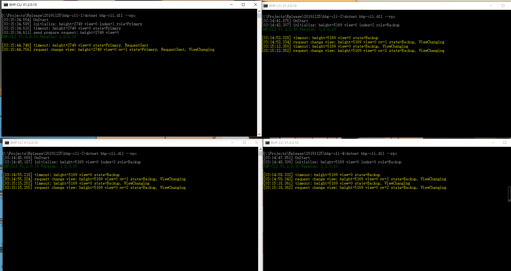

如果关闭所有窗口，将停止私有链。

## 提取 Bhp 和 GAS

在 Bhp 网络的创世块中存放着 4500 万份 Bhp，剩余 5500 万份由挖矿产出，当私链搭建起来后，Gas 也将伴着新区块的生成而生成。你可以使用 BHP-CLI 或 BHP-GUI 从多方签名合约中提取出这部分 BHP 和 GAS 以便内部开发测试使用。

### 从 BHP-CLI 提取

为方便操作，我们需要再准备一个普通节点接入私链，然后从该节点提取 BHP/GAS。

#### 安装和配置普通节点

1. 复制前面步骤中配置好的任意一个共识节点文件，命名为 node0

2. 配置 config.json 文件：

   - 设置每个端口不重复且不被其它程序占用。
   - 设置 UnlockWallet 下的参数 `Path` 和`Password` 为空。
   - 设置 `StartConsensus` 和 `IsActive` 为 `false`。

3. 将之前创建的四个钱包文件复制到 node0 根目录下。

4. 运行普通节点，打开一个钱包并输入命令 `show state` 查看节点状态。

   如果高度发生变化且连接数不为0，则表示节点已接入私链。

   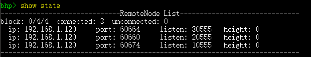

#### 创建多方签名地址

1. 在普通节点上打开任意钱包

2. 使用命令 `import multisigaddress m pubkeys` 创建一个多方签名地址：

   - `m`: 设置最小签名数 3
   - `pubkeys`: 四个共识节点的钱包公钥（配置在 `StandbyValidator` 里 ）

   > [!Note]
   >
   > 四个钱包中都必须创建多方签名地址才能成功完成转账交易的签名。

3. 输入 `list asset`, 可以看到账户里出现了 4500 万 BHP

   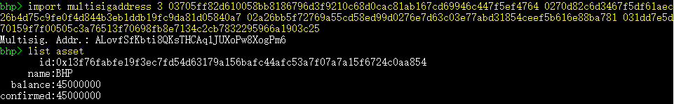

#### 提取 BHP 到普通地址

接下来我们将 BHP 从合约地址转入普通地址：

> [!Note]
>
> 因为 BHP 转账需要手续费，所以不能将 4500 万全部转出，需要预留 0.0001 的BHP作为手续费。

1. 输入命令 `send   ` 将 BHP 转入目标地址。

2. 复制 SignatureContext 内容并关闭钱包。

   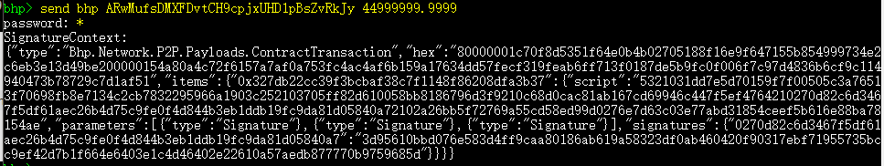

3. 打开多方签名中的第二个钱包。

4. 使用步骤 2 中复制的内容输入命令 ` sign <jsonObjectToSign>`

5. 复制 Signed Output 内容并关闭钱包。

   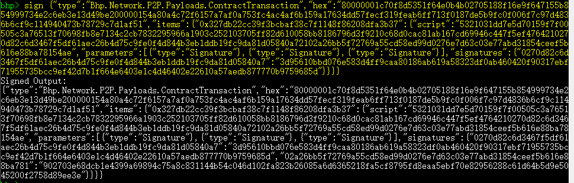

6. 打开第三个钱包重复前面的签名步骤，然后就可以使用 ` relay <jsonObjectToSign> ` 广播交易完成签名。

   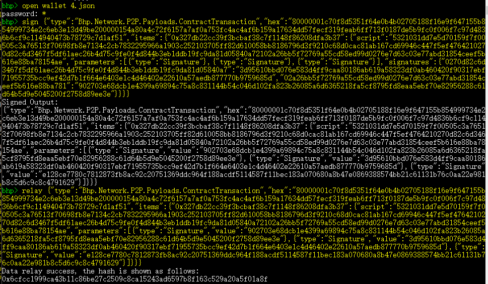

7. 输入 `list asset` 查看钱包资产，可以看到 BHP 已经转入。

   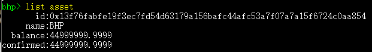

BHP 转出后 GAS 状态变为可提取，使用命令 `show gas` 可以查看可提取的 GAS 数量。参考前面提取 BHP 进行的多方签名操作，提取 GAS 到目标地址即可。

### 从 BHP-GUI 提取

#### 安装并配置 BHP-GUI

1. 从 Github 上下载 [BHP-GUI](https://github.com/BhpAlpha/bhp-gui/releases) 并解压。
2. 修改 BHP-GUI 配置文件 protocol.json 使其连接到私有链中：
   - `StandbyValidators`：将前面创建的四个钱包的公钥填写在这里。
   - `SeedList`：将四台虚拟机的 IP 地址填写在这里，端口号保持不变。
3. 配置 config.json 文件，设置端口与其它四个节点端口不冲突。如果端口冲突，BHP-GUI 将无法与 BHP-CLI 同时运行。

运行 BHP-GUI，打开任意钱包，如果左下角有连接数不为零，而且一直在同步区块，表示该客户端已经成功地连接到了私有链中。

#### 创建多方签名地址

在 BHP-GUI 中依次打开四个钱包，进行以下操作：

1. 右键单击账户页面空白处，选择`创建合约地址` -> `多方签名`在每个钱包里添加多方签名地址。

2. 输入四个钱包的公钥，设置最小签名数量为 3（共识节点数量 / 2 + 1），点击 `确定`。

   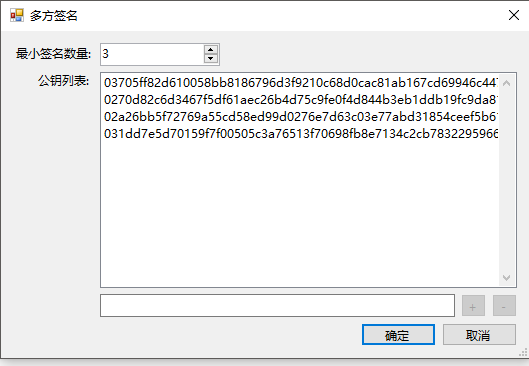

3. 点击 `钱包` -> `重建钱包索引`。

> [!Note]
>
> 四个钱包都要添加多方签名地址，否则签名会失败。

你将看到合约地址中出现了 4500 万 BHP，如图所示。

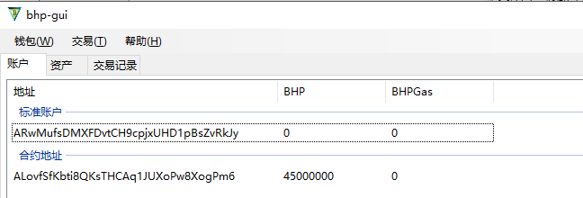

#### 提取 BHP 到标准地址

进行如下操作，将 BHP 从合约地址转到标准地址中：

1. 打开四个钱包中的任意一个，点击 `交易`-> `转账`。

2. 输入要转入的标准地址，将 BHP 转到这个地址中。

3. 系统会提示“交易构造完成，但没有足够的签名”，将代码复制下来。

4. 打开第二个钱包，点击 `交易` ->`签名` 。

5. 粘贴刚才复制的代码，点击 `签名`， 然后将生成的代码复制下来。

6. 打开第三个钱包，点击 `交易`-> `签名`，粘贴刚才复制的代码，点击 `签名`。

   这时窗口中显示 `广播` 按钮，代表交易已经签名完成，达到多方签名合约要求的最少签名数量，可以广播。

7. 点击 `广播` 完成转账交易。

   等待片刻后将看到 BHP 成功转入了标准地址。

   > [!Note]
   >
   > 因为 BHP 转账需要手续费，所以不能将 4500 万全部转出，需要预留 0.0001 的BHP作为手续费。

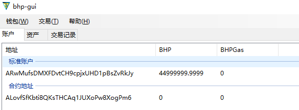

#### 提取 GAS 到标准地址

打开要转入 GAS 的钱包账户，点击 `高级` -> `提取 BhpGas` -> `全部提取`。

> [!Note]
>
> GAS 有两种状态，可提取和不可提取。当账户中的 BHP 花费后（即转出），其产生的 GAS 会转变成可提取状态。你可以通过给自己转账将 GAS 变为可提取状态，即使钱包里只有一个地址也可以。

接下来的操作与转账 BHP 类似，将没有足够签名的代码复制下来，依次打开第二个和第三个钱包，完成交易签名和广播。提取成功后如下图所示。

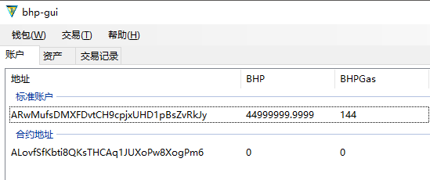

