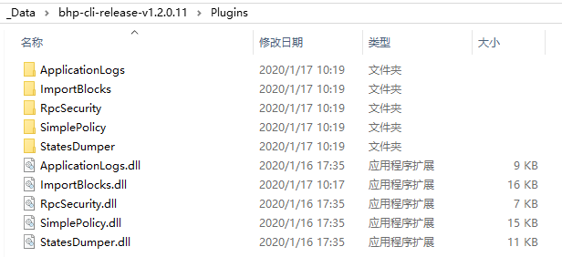

# 配置与启动节点

完成 BHP-CLI 的安装后，本节我们将进行启动前的必要配置以及使用命令启动节点。

## 修改配置文件

BHP-CLI 在执行过程中会访问两个配置文件 `config.json` 和 `protocol.json`。启动 BHP-CLI 前需要对这两个文件进行必要配置。有关这两个文件的具体属性说明，请参见 [BHP-CLI 结构](../../tooldev/structure.md)

### 配置钱包

启动 BHP-CLI 前，你需要在 `config.json` 中开启自动绑定并打开钱包功能，钱包打开后才可以调用与钱包相关的 API。配置参数如下：

- Path：钱包路径
- Password：钱包密码
- IsActive：设为 true 允许自动打开钱包
- AutoLock：是否自动锁定钱包

下面是一个标准设置的例子：

```json
  {
  "ApplicationConfiguration": {
    "Paths": {
      "Chain": "Chain_{0}",
      "Index": "Index_{0}"
    },
    "P2P": {
      "Port": 20555,
      "WsPort": 20556
    },
    "RPC": {
      "BindAddress": "127.0.0.1",
      "Port": 20557,
      "SslCert": "",
      "SslCertPassword": ""
    },
    "UnlockWallet": {
      "Path": "",
      "Password": "",
      "StartConsensus": false,
      "IsActive": false,
      "AutoLock": false,
      "IsBhpFee": false
    },
    "PluginURL": "",
    "DataRPC": {
      "Host": "http://exp.bhpa.io:7070"
    },
    "ExportWallet": {
      "Path": "",
      "Interval": 8,
      "IsActive": false
    }
  }
}
```

> [!Note]
>
> BindAddress 选项，默认为本地 127.0.0.1。若要允许远程调用 RPC，可以设成 0.0.0.0，此时为了保障节点的安全性，请务必设置好对应端口的防火墙策略。

### 将节点连接到网络

BHP-CLI 默认接入主网，如果要连接测试网，你需要用 BHP-CLI 目录下的`config.testnet.json` 和`protocol.testnet.json` 文件分别替换原有配置文件 `config.json` 和 `protocol.json`。相关信息，请参见[主网与测试网](../../network/network.md)

如果要将节点接入私链，需要配置 `protocol.json` 文件。详细信息，请参见[搭建私有链](../../network/privateChain.md)中的修改`protocol.json` 说明。

## 安装插件

一些附加功能被独立封装在插件中用以调用，目的是为了提升节点的安全性，稳定性和灵活性。用户可以自行选取所需要的扩展功能而不用每次在启动 BHP-CLI 时通过附加参数来调用，避免了很多人为的失误操作同时简化了打开钱包，调用 API 等一系列繁琐的指令。

### 从 GitHub 下载插件

下表列出了所有插件，选取所需要的插件进行下载。

| 插件                                                         | 功能                                                         | 包含API                                                      |      |
| ------------------------------------------------------------ | ------------------------------------------------------------ | ------------------------------------------------------------ | ---- |
| [ImportBlocks](https://github.com/BhpAlpha/bhp-plugins/releases) | 同步离线包                                                   |                                                              | 必选 |
| [SimplePolicy](https://github.com/BhpAlpha/bhp-plugins/releases) | 过滤非法交易                                                 |                                                              | 必选 |
| [ApplicationLogs](https://github.com/BhpAlpha/bhp-plugins/releases) | 在 RPC 模式下自动同步智能合约日志（ApplicationLogs），目前日志已经改为以 LevelDB 格式存储 | [getapplicationlog](../../reference/rpc/api/getapplicationlog.md) | 必选 |
| [RpcBrc20Tracker](https://github.com/BhpAlpha/bhp-plugins/releases) | 提供 BRC-20 余额及交易历史的 RPC 查询功能。                  | [getbrc20balances](../../reference/rpc/api/getbrc20balances.md) [getbrc20transfers](../../reference/rpc/api/getbrc20transfers.md) | 推荐 |
| [RpcSystemAssetTracker](https://github.com/BhpAlpha/bhp-plugins/releases) | 查询 UTXO 资产相关信息。                                     | [getunclaimed](../../reference/rpc/api/getbrc20transfers.md) [getclaimable](../../reference/rpc/api/getbrc20transfers.md) [getunspents](../../reference/rpc/api/getbrc20transfers.md) | 推荐 |
| [StatesDumper](https://github.com/BhpAlpha/bhp-plugins/releases) | 导出 Bhp-CLI 状态数据                                        |                                                              | 可选 |
| [RpcSecurity](https://github.com/BhpAlpha/bhp-plugins/releases) | 对 HTTP Request 进行 base64 加密，提升 RPC 请求的安全性。需要在该插件的 config.json 文件中设置 username 和 password |                                                              | 可选 |


将下载的插件包解压到 Bhp-cli 根目录下，解压完成后的目录结构应如下图。



## 快速同步区块数据

客户端运行时会自动同步区块数据，打开钱包时也会自动同步钱包数据，当同步完成后才可以正常使用客户端以及查看钱包内资产。由于区块链数据庞大，初次同步时等待时间通常很久，建议采用离线同步包进行同步，相关信息，请参见 [快速同步区块数据](../syncblocks.md)

## 启动 Bhp 节点

打开命令行，定位到 BHP-CLI 所在目录，输入以下命令启动 Bhp 节点 。

**Windows 10**:

```
dotnet bhp-cli.dll
```

或

```
bhp-cli.exe
```

**Linux (ubuntu 16.04/18.04)**:

```
./bhp-cli
```

或

```
dotnet bhp-cli.dll
```

> [!Note]
>
> 如果使用 dotnet，需要先安装 .net core 环境。

如果想在启动节点的同时启动 API 服务，可以输入参数 `--rpc`  或 `/rpc` 或 `-r`，如：

```
dotnet bhp-cli.dll --rpc
```

如果你想让外部程序访问该节点的 API 需要开放防火墙端口：20555-20557

> [!WARNING]
>
> 如果开通了 API 服务，并且在 BHP-CLI 中打开钱包的话，需要设置防火墙策略，例如设置防火墙的白名单，这些端口仅对白名单的 IP 地址开放。如果完全对外开放，其它人可能会通过 API 导出私钥或者进行转账。

## 阅读下节

[节点列表](seedlist.md)

