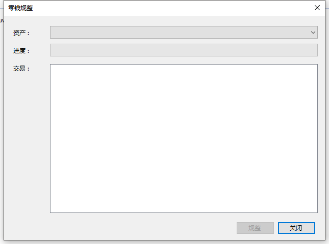

# 零钱规整

将钱包内地址的大量UTXO通过交易的方式整合成少量的UTXO。避免在使用中，因为UTXO过多而无法写入区块。

## 使用

1. 打开BHP-GUI，打开一个钱包，点击 `钱包` -> `零钱规整` 。

   

2. 选择一种资产点击 `规整` 即可

   - 钱包内所有地址的该资产规整完成（该资产的UTXO总量不超过5个）时， `规整` 按钮变为可用，规整结束。规整过程是以交易的方式进行，将按照普通转账的方式收取手续费，规整的交易将输出到规整窗体的 `交易` 区域内。
   - 若该资产UTXO过多，将按照每笔交易不超过100个输入的方式构造交易。
   - 规整完成的资产将汇聚到最后一次规整所查找的输入地址里。

   

