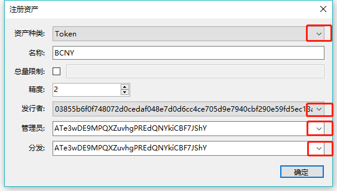
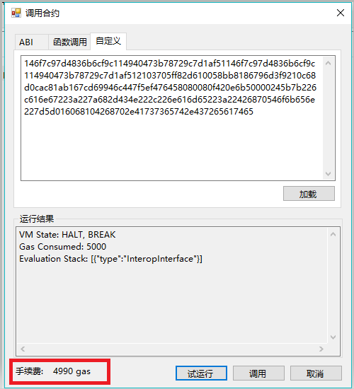
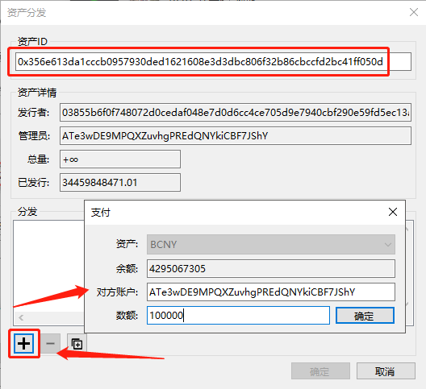

# 注册与分发资产 

## 注册资产 

​		您可以在 BHP 区块链中创设一种新的发行资产，可以自己定义资产的类型、名称、总量等，并指定资产的管理员账户。创设资产需要消耗一定数量的 GAS 作为附加服务费，目前为 4990 GAS。

​		资产类型有两种，代币（Token） 和 股份 （Share，转账时需要双方签名）。以下操作步骤以 Token 为例：

1. 在 BHP-GUI 中点击 `高级` -> `注册资产` 。填写以下选项并点击 `确定` ：

   - 资产种类：设置资产类型：代币（Token）或 股份 （Share）
   - 名称：设置资产名称。资产发行后，可以在 BHP-GUI 的资产页签中或者区块链浏览器中查看到资产名称。
   - 总量限制：如果要限制资产发行总量，选取此项并设置上限。
   - 精度：资产的最小单位数。默认为 8，表示最小单位为 0.00000001。如果设置为 0，表示最小单位为 1。
   - 发行者：设置资产的发行者。
   - 管理员：管理员可以修改资产的名称、总量等。目前功能尚未支持。
   - 分发：设置分发资产的地址。

   

   > [!Note] 管理员和分发人员可以是任意可用地址

2. 注册资产通过调用智能合约来完成，如下图所示，点击 `试运行` ，即可看到所需手续费详情：

   同时，您也可以选择加载本地写好的智能合约文档。

   需要注意的是，注册资产需花费大量手续费（目前为 4990 GAS），请谨慎操作。

   

3. 确认注册资产，点击 `调用` 。

4. 返回交易成功结果，复制交易 ID 并粘贴到记事本，以备资产分发时使用。

您也可以在交易记录中查看到注册资产的交易编号并右键单击复制交易 ID。

> [!Note] 交易确认后即可分发资产。

## 分发资产 

> [!Note] 
>
> 每次分发资产需花费手续费（目前为 1 GAS），请谨慎操作，可以选择一次性批量分发以节省费用。
>
> 实际分发数额=数额/10<sup>(8-精度)</sup>，例如精度为3的资产，输入数额必须大于100，输入100即实际分发资产0.001。

### 在BHP-GUI中分发资产

​		完成资产注册后，就可以在资产创设所设定的总量上限范围内，向发行人指定的地址中发放该资产。分发后的资产可以用于转账和交易。分发资产需要消耗一定数量的 GAS 作为附加服务费，目前为 1 GAS。

1. 在 BHP-GUI 中点击 `高级` -> `分发资产` 。

2. 将在注册资产最后一步中复制的交易 ID 粘贴到 `资产 ID` 中，会自动显示对应的资产详情。

   如果交易 ID 以 ”0x“ 开始，需要删去”0x“ 再输入。

3. 点击加号按钮输入要分发资产的账户地址和数额，点击确定。

   分发完毕后可以在钱包资产中查看到用户创设的资产。



### 调用RPC分发资产

> [!Note] 执行此命令前需要在 Bhp-CLI 节点中打开钱包。只有该资产注册时设置的资产发行人可发行该资产。

#### 参数说明

- asset_id：资产 ID（资产标识符），即该资产在注册时的 RegistTransaction 的交易 ID。其余资产 ID 可以通过 CLI 命令 中的 list asset 命令查询，也可以在区块链浏览器中查询。

- <outputs_array>

  outputs_array：数组，数组中的每个元素的数据结构如下： {"address": <address>,"value": <value>}

  - address：收款地址
  - value：转账金额

#### 调用示例

请求正文：

```
{
  "jsonrpc": "2.0",
  "method": "sendissuetransaction",
  "params": [
    "0x356e613da1cccb0957930ded1621608e3d3dbc806f32b86cbccfd2bc41ff050d",
    [
      {
        "address": "ATe3wDE9MPQXZuvhgPREdQNYkiCBF7JShY",
        "value": "2"
      }
    ]
  ],
  "id": 1
}
```

响应正文：

```
{
    "jsonrpc": "2.0",
    "id": 1,
    "result": {
        "txid": "0x2653b37ab99ae57f78bcffbe636c1afa51b2818f46f79b074d8f783984ef681a",
        "size": 262,
        "type": "IssueTransaction",
        "version": 1,
        "attributes": [],
        "vin": [
            {
                "txid": "0xe494c0d54e35ea0a29305fb06ca24aa29765be5f446f4e72a65f0f893ec4d219",
                "vout": 0
            }
        ],
        "vout": [
            {
                "n": 0,
                "asset": "0x356e613da1cccb0957930ded1621608e3d3dbc806f32b86cbccfd2bc41ff050d",
                "value": "2",
                "address": "ATe3wDE9MPQXZuvhgPREdQNYkiCBF7JShY"
            },
            {
                "n": 1,
                "asset": "0xa60b5dbb2b50022e3179a5a129b4d90bbb5bf5caabc40893fcdb83703e751225",
                "value": "0.64418228",
                "address": "ATe3wDE9MPQXZuvhgPREdQNYkiCBF7JShY"
            }
        ],
        "sys_fee": "0",
        "net_fee": "1",
        "tx_fee": "0",
        "scripts": [
            {
                "invocation": "40f18a546b2b172cb9aa28014b48d5a85e9890fd38b7ffd931b1da9f3f218ee9b2304cd6c8000bb3276bb0e53287c29428fbce4f36f05ae05a434e14126880a848",
                "verification": "2103855b6f0f748072d0cedaf048e7d0d6cc4ce705d9e7940cbf290e59fd5ec13aa4ac"
            }
        ]
    }
}
```

响应说明：

- 返回如上的交易详情说明交易发送成功，否则交易发送失败
- JSON 格式不正确，会返回 Parse error
- 如果签名不完整会返回待签名的交易
- 如果余额不足会返回错误信息