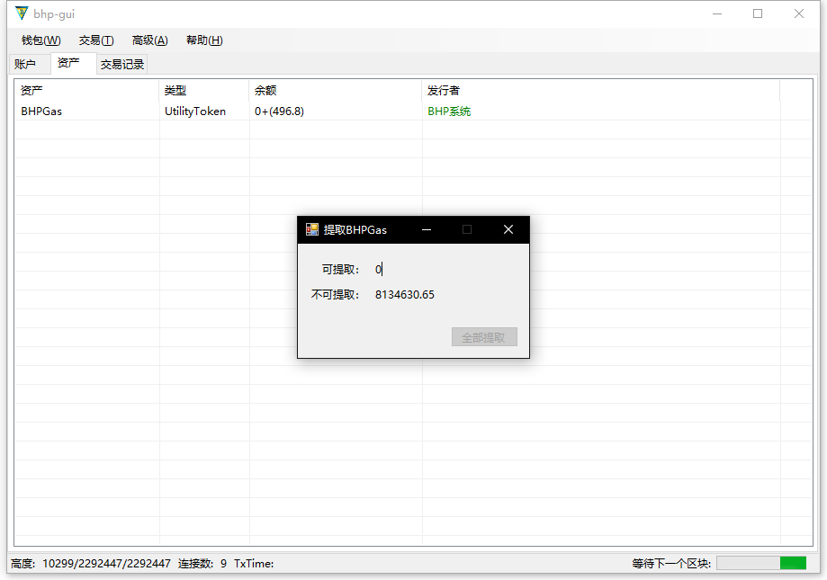

# 其它功能

## 提取 BhpGas

BhpGas（简称 GAS） 伴随着每个新区块的生成而产生，会按照 BHP 的持股比例，记录在 BHP 地址上（资产余额中的括号里的数目即为待认领的 GAS 数目）。BHP 持有人可以在任意时间进行发起一笔提取交易，将这些 GAS 提取到 BHP 的地址上。

未提取的 GAS 有两种状态，可提取和不可提取，对应于 BHP 的两种状态：已花费和未花费。一个 BHP 的生命周期以转入地址开始，转出地址截止，转入时状态变为未花费，转出时状态变为已花费。当 BHP 处于未花费状态时，所产生的 Gas 为不可提取。当 BHP 处于已花费状态时，期间所产生的 GAS 变为可以提取。如何将钱包中的所有不可提取GAS 转为可提取呢？很简单，将钱包中的所有 BHP 转到钱包中的任意一个地址即可。

具体操作步骤为：

1. 在 BHP-GUI 中，对钱包中的所有 BHP 进行一次转账操作（可以转给当前地址），待认领的 BhpGas 才会结算一次，变得可提取。
2. 点击 `高级` ->`提取 BhpGas` 。
3. 点击 `全部提取`。

