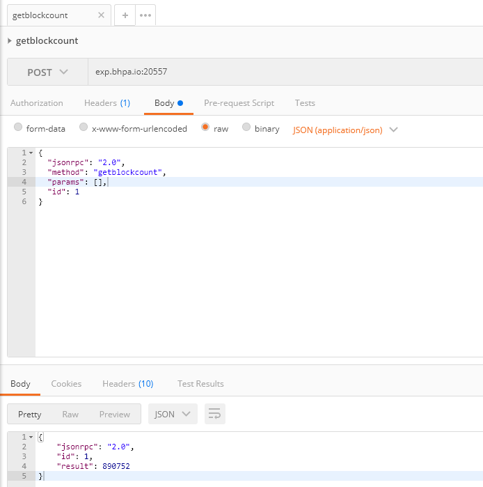

# API 参考

> 新增：
>
> - getcontractopcode

每个 BHP 节点 Bhp-CLI 都可选的提供了一套 API 接口，用于从节点获取区块链数据，使得开发区块链应用变得十分方便。接口通过 [JSON-RPC](http://wiki.geekdream.com/Specification/json-rpc_2.0.html) 的方式提供，底层使用 HTTP/HTTPS 协议进行通讯。要启动一个提供 RPC 服务的节点，可运行以下命令：

```
dotnet bhp-cli.dll --rpc
```

## 监听端口

JSON-RPC 服务器启动后，会监听 TCP 端口，默认端口如下。

|               | 主网（Main Net） | 测试网（Test Net） |
| ------------- | ---------------- | ------------------ |
| JSON-RPC HTTP | 20557            | 20557              |

## 命令列表

| 方法                                                         | 参数                                                         | 说明                                                 | 备注                        |
| ------------------------------------------------------------ | ------------------------------------------------------------ | ---------------------------------------------------- | --------------------------- |
| [getnewaddress](api/getnewaddress.md) |                                                              | 创建一个新的地址                                     | 需要打开钱包                |
| [listaddress](api/listaddress.md) |                                                              | 列出当前钱包内的所有地址                             | 需要打开钱包                |
| [dumpprivkey](api/dumpprivkey.md) | < address >                                                  | 导出指定地址的私钥                                   | 需要打开钱包                |
| [exportaddresswif](api/exportaddresswif.md) | < address >                                                  | 获取地址的相关信息                                   | 需要打开钱包                |
| [validateaddress](api/validateaddress.md) | < address >                                                  | 验证地址是否是正确的BHP地址                          |                             |
| [getaccountstate](api/getaccountstate.md) | < address >                                                  | 根据账户地址，查询账户资产信息                       |                             |
| [getassetstate](api/getassetstate.md) | < asset_id >                                                 | 根据指定的资产编号，查询资产信息                     |                             |
| [getbalance](api/getbalance.md) | < asset_id >                                                 | 根据指定的资产编号，返回钱包中对应资产的余额信息     | 需要打开钱包                |
| [getblockcount](api/getblockcount.md) |                                                              | 获取主链中区块的数量                                 |                             |
| [getbestblockhash](api/getbestblockhash.md) |                                                              | 获取主链中高度最大的区块的散列                       |                             |
| [getblockhash](api/getblockhash.md) | < index >                                                    | 根据指定的索引，返回对应区块的散列值                 |                             |
| [getblock](api/getblock.md) | < hash > [verbose=0]                                         | 根据指定的散列值，返回对应的区块信息                 |                             |
| [getblock](api/getblock2.md) | < index > [verbose=0]                                        | 根据指定的索引，返回对应的区块信息                   |                             |
| [getblockheader](api/getblockheader.md) | < hash > [verbose=0]                                         | 根据指定的散列值，返回对应的区块头信息。             |                             |
| [getpeers](api/getpeers.md) |                                                              | 获得该节点当前已连接/未连接的节点列表                |                             |
| [getconnectioncount](api/getconnectioncount.md) |                                                              | 获取节点当前的连接数                                 |                             |
| [getversion](api/getversion.md) |                                                              | 获取查询节点的版本信息                               |                             |
| [getvalidators](api/getvalidators.md) |                                                              | 查看当前共识节点的信息                               |                             |
| [getcontractstate](api/getcontractstate.md) | < script_hash >                                              | 根据合约脚本散列，查询合约信息                       |                             |
| [invoke](api/invoke.md) | < script_hash > < params >                                   | 使用给定的参数以散列值调用智能合约                   |                             |
| [invokefunction](api/invokefunction.md) | < script_hash > < operation > < params >                     | 以指定的脚本散列值调用智能合约，传入操作及参数       |                             |
| [invokescript](api/invokescript.md) | < script >                                                   | 通过虚拟机运行脚本并返回结果                         |                             |
| [sendrawtransaction](api/sendrawtransaction.md) | < hex >                                                      | 广播交易                                             |                             |
| [getrawmempool](api/getrawmempool.md) |                                                              | 获取内存中未确认的交易列表                           |                             |
| [getrawtransaction](api/getrawtransaction.md) | < txid > [verbose=0]                                         | 根据指定的散列值，返回对应的交易信息                 |                             |
| [gettransactionheight](api/gettransactionheight.md) | < txid >                                                     | 获取交易高度。                                       |                             |
| [gettxout](api/gettxout.md) | < txid > < n >                                               | 根据指定的散列和索引，返回对应的交易输出（零钱）信息 |                             |
| [getstorage](api/getstorage.md) | < script_hash > < key >                                      | 根据合约脚本散列和存储的 key，返回存储的 value       |                             |
| [getblocksysfee](api/getblocksysfee.md) | < index >                                                    | 根据指定的索引，返回截止到该区块前的系统手续费       |                             |
| [getwalletheight](api/getwalletheight.md) |                                                              | 获取当前钱包索引高度                                 | 需要打开钱包                |
| [unlock](api/unlock.md) | < password >< seconds >                                      | 解锁钱包                                             | 需要打开钱包                |
| [getutxos](api/getutxos.md) | < address >[asset_id]                                        | 获取指定地址的未花费UTXO                             | 需要打开钱包                |
| [sendfrom](api/sendfrom.md) | < asset_id > < from >< to > < value > [fee=0] [change_address] [remark] [fee_address] | 从指定地址，向指定地址转账                           | 需要打开钱包                |
| [sendtoaddress](api/sendtoaddress.md) | < asset_id > < address > < value > [fee=0] [change_address] [fee_address] | 向指定地址转账                                       | 需要打开钱包                |
| [sendmany](api/sendmany.md) | < outputs_array > [fee=0] [change_address] [fee_address]     | 批量转账命令                                         | 需要打开钱包                |
| [sendtocold](api/sendtocold.md) | < address > [asset_id] [fee_address]                         | 将钱包内的资产转账到指定地址                         | 需要打开钱包                |
| [submitblock](api/submitblock.md) | < hex >                                                      | 提交新的区块                                         | 需要成为共识节点            |
| [gettransactiondata](api/gettransactiondata.md) | < asset_id > < address > < value > [fee=0] [change_address] [fee_address] | 获取交易的十六进制字符串                             | 需要打开钱包                |
| [verifytx](api/verifytx.md) | < hex >                                                      | 验证交易是否有效                                     |                             |
| [showgas](api/showgas.md) |                                                              | 返回本钱包的bhpgas                                   | 需要打开钱包                |
| [claimgas](api/claimgas.md) |                                                              | 提取bhpgas                                           | 需要打开钱包                |
| [sendissuetransaction](api/sendissuetransaction.md) | < asset_id >< outputs_array >                                | 分发资产                                             | 需要打开钱包                |
| [listsinceblock](api/listsinceblock.md) | < start_height >[target_confirmations]                       | 根据参数返回与钱包相关的所有交易                     | 需要打开钱包                |
| [sendtoaddressorder](api/sendtoaddressorder.md) | < order >< asset_id > < address > < value > [fee=0] [change_address] [fee_address] | 发送一个包含订单信息的交易                           | 需要打开钱包                |
| [getrawtransactionorder](api/getrawtransactionorder.md) | < txid > [verbose=0]                                         | 根据指定的散列值，返回对应的交易信息                 |                             |
| [get_tx_list](api/get_tx_list.md) | < address >< position>< offset>                              | 获取指定地址的交易列表                               |                             |
| [gettransaction](api/gettransaction.md) | < address >< position>< offset>                              | 获取指定地址的交易                                   |                             |
| [getutxoofaddress](api/getutxoofaddress.md) | < address >                                                  | 获取指定地址的未花费UTXO                             |                             |
| [getapplicationlog](api/getapplicationlog.md) | < txid >                                                     | 根据指定的 BRC-6 交易 ID 获取合约日志                | 需要安装ApplicationLogs插件 |
| [getcontractopcode](api/getcontractopcode.md) | < hex >                                                      | 获取合约脚本的指令解析                               |                             |

## POST 请求示例

一次典型的 JSON-RPC Post 请求的格式如下：

下面以获取主链中区块的数量方法为例。

请求 URL：

`http://exp.bhpa.io:20557`

请求 Body：

```
{
  "jsonrpc": "2.0",
  "method": "getblockcount",
  "params": [],
  "id": 1
}
```


发送请求后，将会得到如下的响应：

```
{
    "jsonrpc": "2.0",
    "id": 1,
    "result": 890746
}
```

> [!Note]
>
> 当使用离线同步包同步区块时，程序可能无法响应 API 请求，建议将区块同步到最新高度后再使用 API，否则返回的结果可能不是最新的。

## 测试工具

你可以用 Chrome 扩展程序中的 Postman 来方便地进行测试（安装 Chrome 扩展程序需要科学上网），下面是测试截图：

