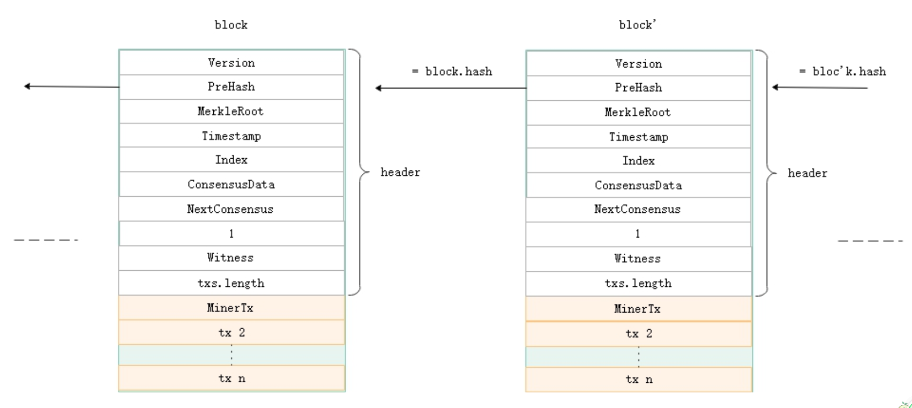
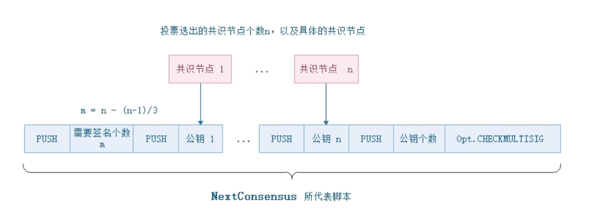

# 区块

区块链（Blockchain）本身是一种数据结构。区块大致由区块头和区块主体两部分组成。因为每个区块（头）里都存有上一个区块的 hash 值(参见`区块头`部分中的`PrevHash`)，从而形成了一种链式结构。

区块的数据结构见下：

| 字节数 | 字段          | 名称           | 类型          | 描述                                              |
| ------ | ------------- | -------------- | ------------- | ------------------------------------------------- |
| 4      | Version       | 区块版本       | uint          | 区块版本号，目前为 `0`                            |
| 32     | PrevHash      | 上一个区块Hash | UInt256       | 上一个区块的 hash 值                              |
| 32     | MerkleRoot    | Merkle树       | Uint256       | 该区块中所有交易的 Merkle 树的根                  |
| 4      | Timestamp     | 时间戳         | uint          | 该区块生成的大致时间                              |
| 4      | Index         | 区块高度       | uint          | 创世块的高度为 0                                  |
| 8      | ConsensusData | Nonce          | ulong         | 为共识过程需要预生成的一个随机数据                |
| 20     | NextConsensus | 下一个共识地址 | UInt160       | 下一轮出块的三分之二以上的共识节点的签名脚本 hash |
| 1      | -             | -              | uint8         | 固定为 1，在序列化时添加在Witness 前面            |
| ?      | Witness       | 见证人         | Witness       | 可执行验证脚本                                    |
| ?\*?   | Transactions  | 交易列表       | Transaction[] | 区块的主数据                                      |

### 区块头

区块头包含了一个区块的基本信息，用以保证这个区块能正确地连入区块链。区块的前 10 个数据构成了区块头。

区块 hash 值和区块高度 Index 都可以用作区块的标识。区块 hash 值是对区块头的前 7 个数据拼合在一起进行两次 SHA256 运算而得。正常运行时，BHP 只会有一条链，且每个区块均由共识节点三分之二以上的节点确认之后才被加入到区块链中，所以区块链上的每一个块的高度唯一。区块高度必须等于前一个区块高度加 1。因为任何区块内的信息变化都会造成区块hash值改变，所以区块 hash 值是区块的唯一标识。区块高度不受区块内信息影响，安全性稍低，无法成为唯一标识。

`Timestamp`是每个区块的时间戳，必须晚于其前一个区块的时间戳。两个块确认的时间间隔在 15 秒左右，由系统配置文件`protocol.json`中，变量`SecondsPerBlock`所设定。

`NextConsensus`是一个多方签名脚本的hash值，脚本验证时，需要三分之二以上的共识节点的签名作为参数。示例脚本如下图。每一个区块，都会带有`NextConsensus`字段，锁定了参与下一轮共识的节点。在上一轮共识中，当时的议长节点根据当时的投票结果计算出了下一轮的共识节点，再生成多方签名合约，并将合约脚本hash值存入到提案块的`NextConsensus`字段中。若提案块最后达成共识，成为被确认的块，则本轮的共识验证人是上一个被确认的块里的多方签名合约地址之一。

`Witness`是这个区块的验证脚本。它的结构是执行脚本（`InvocationScript`）加上验证脚本(`VerificationScript`)。执行脚本就包含进行验证所需要的参数，而验证脚本就是具体验证要使用的脚本。

### 区块主体
除去区块头，剩下的便是由一个交易列表组成的区块主体。严格讲，区块主体以交易列表长度开始，后面罗列各条交易。此轮共识的议长将从其内存池队列中挑出通过验证的一串交易，将其放入一个共识包（`InventoryType = 0xe0`）中再发送到网络里。共识过程相对复杂，请参见"共识机制"章节。

每一个区块的第一条交易都必须是`MinerTransaction`交易类型，作用是存放该块中的交易网络费的分配情况。

> [!NOTE]
>
> Block 在做持久化(`persist`)时，存放的是交易 hash 列表，而交易的数据另外单独存放，以方便查询。
