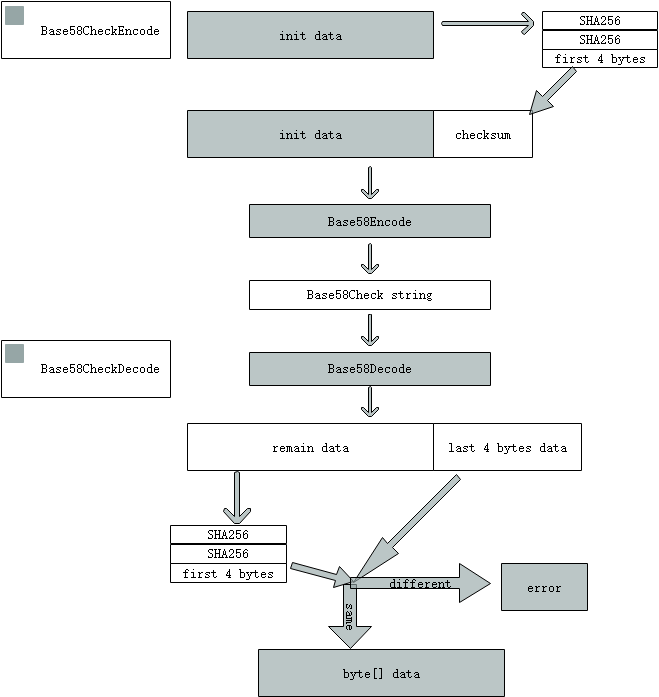

# 编码算法

## Base58

Base58 是一种将非可视字符与可视化字符(ASCII)相互转化的编解码方法。实现了数据的压缩、便于阅读，适用于抗自动监视的传输系统的底层编码机制，但缺乏校验机制，无法检测出传输过程中字符串的遗漏，需要配合改进算法 Base58Check 使用。

Base58 采用数字、大写字母、小写字母（去除歧义字符 0 (零), O (大写字母O), I (大写的字母i) and l (小写的字母L) ），总计 58 个字符作为编码的字母表。

BHP 使用的字母表为：**123456789ABCDEFGHJKLMNPQRSTUVWXYZabcdefghijkmnopqrstuvwxyz**

接口定义：

- 编码方法：把 byte[] 数据编码成 Base58 字符串 String 数据

```c#
string Encode(byte[] input)
```

- 解码方法：Base58 字符串 String 解码成 byte[] 数据

```c#
byte[] Decode(string input)
```

**编码步骤**：

1.  在 byte[] 数据前添加一个 0x00，生成一个新的 byte 数组，并将新数组做反转操作

2.  把数组的数据转成 10 进制 BigInteger 数

3.  把 BigInteger 数按字母表转换成 58 进制字符串

4.  统计原 byte[] 数据中 0x00 的个数 count，在字符串前补 count 个字母表游标为零所对应的字符

**解码步骤**：

1.  将输入的字符串按 Base58 字母表转换成 10 进制 BigInteger 数

2.  把 Biginteger 数转换成 byte[] 数据，并将 byte[] 数据倒序排序

3.  统计原输入的字符串中字母表游标为零所对应的字符的个数 count

4.  若 byte[] 数据的长度大于1，且 byte[0] 等于0，且 byte[1] 大于等于 0x80，则从 byte[1] 开始截取，否则从 byte[0] 开始截取，得到结果。

Example:

| 字符串 | byte[] |
| --- | --- |
| <nobr>AXfgAN3coFD1LXbAyCnnMS8LmmSNVrJCt9</nobr> | [0x117,0xae,0x55,0xed,0xf4,0x32,0x42,0x30,0xbe,0xa3,0xf5,0xd1,0x93,0x04,0x18,0xf9,0xcd,0x50,0xbf,0x8d,0x45] |

**应用场景**：

为 Base58Check 编解码方法提供服务。

## Base58Check


Base58Check 是基于 Base58 的改进型编解码方法。通过对原数据添加数据的哈希值作为盐，弥补了Base58 缺少效验机制的缺点。

接口定义：

- 编码方法：把 byte[] 数据编码成带校验功能 Base58 字符串 String 数据

```c#
string Base58CheckEncode(byte[] input)
```

- 解码方法：把带校验功能 Base58 字符串 String 解码成 byte[] 数据

```c#
byte[] Base58CheckDecode(string input)
```

**编码步骤**：

1.  通过对原 byte[] 数据做两次 sha256 得到原数据的哈希，取其前 4 字节作为版本前缀 checksum，添加到原 byte[] 数据的末尾。

2.  把添加了版本前缀的 byte[] 数据做 Base58 编码得到对应的字符串。

**解码步骤**：

1.  把输入的字符串做 Base58 解码，得到 byte[] 数据。

2.  取 byte[] 数据收字节到倒数第4字节前的所有数据 byte[] 称作 data。

3.  把 data 做两次 SHA256 得到的哈希值的前4字节作为版本前缀 checksum，与 byte[] 数据的后4字节比较是否相同，相同则返回data, 否则判定为数据无效。



Example:

| 字符串 | byte[] |
| --- | --- |
| <nobr>AXfgAN3coFD1LXbAyCnnMS8LmmSNVrJCt9</nobr> | [0x117,0xae,0x55,0xed,0xf4,0x32,0x42,0x30,0xbe,0xa3,0xf5,0xd1,0x93,0x04,0x18,0xf9,0xcd,0x50,0xbf,0x8d,0x45] |

**应用场景**：

1. 导入、导出输出 wif 格式的密钥     

2. 合约脚本哈希与地址字符串相互转换

3. 导入、导出 BRC2 格式密钥
