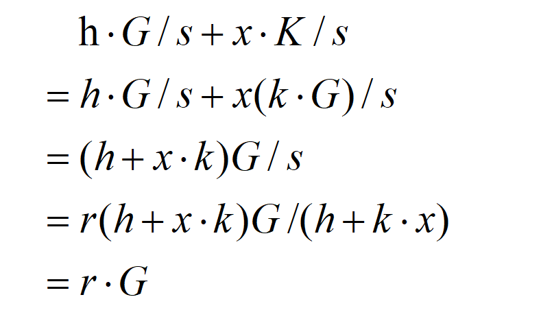

# 加密算法

## ECC 椭圆曲线加密

ECC 椭圆曲线素数加密算法是一种非对称加密算法。利用其 K=k\*G 过程不可逆的特性（其中 K 为公钥，G 为基点（常数点）），可以预防通过公钥暴力求解私钥。相较于 RSA 等其他加密算法，在相同密钥长度情况下，其具备更高的安全性，同时更节约算力。ECC 结合其他算法广泛应用于签名等领域，例如 ECDSA 数字签名。

BHP 与比特币一样都采用 ECC 作为其公钥生成算法，BHP采用了secp256k1标准所定义的一条特殊的椭圆曲线，使用的参数：

素数素数Q：00FFFFFFFFFFFFFFFFFFFFFFFFFFFFFFFFFFFFFFFFFFFFFFFFFFFFFFFEFFFFFC2F

椭圆曲线的系数A：0

椭圆曲线的系数B：7

阶数N：00FFFFFFFFFFFFFFFFFFFFFFFFFFFFFFFEBAAEDCE6AF48A03BBFD25E8CD0364141

基点G：(0x79BE667EF9DCBBAC55A06295CE870B07029BFCDB2DCE28D959F2815B16F81798,
　　　　0x483ADA7726A3C4655DA4FBFC0E1108A8FD17B448A68554199C47D08FFB10D4B8)

Example:

| 名称 | 数值 |
| --- | --- |
| 私钥   | 1f9f747e54f92484a2c3b59fb274c87021461238c78f42515fa712012a8e3b6a |
| 公钥(压缩型) | 03705ff82d610058bb8186796d3f9210c68d0cac81ab167cd69946c447f5ef4764 |
| 公钥(非压缩型) | 04705ff82d610058bb8186796d3f9210c68d0cac81ab167cd69946c447f5ef4764e1aacc0b4d7427fd2f5085fc94b9bf7e66910e3f897e503c5de465abc44af59d |

应用场景：

- 私钥生成公钥

- 签名和验证签名

更多信息，请参考[一个关于椭圆曲线密码学的初级读本 ](https://arstechnica.com/information-technology/2013/10/a-relatively-easy-to-understand-primer-on-elliptic-curve-cryptography/)。

## ECDSA 签名

椭圆曲线数字签名算法（ECDSA）是使用椭圆曲线密码（ECC）对数字签名算法（DSA）的模拟。其优点是速度快，强度高，签名短。

其基本使用方法如下：

假设私钥、公钥、基点分别为k、K、G，根据ECC算法可知有K = k·G。

签名过程：

   1. 选择随机数r，计算点 r·G(x, y)。

   2. 根据随机数 r、消息M的哈希 h、私钥 k，计算 s = (h + k·x)/r。
    
   3. 将消息 M、和签名 {r·G, s} 发给接收方。

验证过程：

   1. 接收方收到消息M、以及签名 {r·G=(x,y), s}。

   2. 根据消息 M 求哈希 h。
   
   3. 使用发送方公钥K计算：h·G/s + x·K/s，并与 r·G 比较，如相等即验签成功。

推导原理如下：

Example:

| 名称 | 数值                                                         |
| ---- | ------------------------------------------------------------ |
| 消息 | Hello World                                                  |
| 私钥 | 1f9f747e54f92484a2c3b59fb274c87021461238c78f42515fa712012a8e3b6a |
| 公钥 | 04705ff82d610058bb8186796d3f9210c68d0cac81ab167cd69946c447f5ef4764e1aacc0b4d7427fd2f5085fc94b9bf7e66910e3f897e503c5de465abc44af59d |
| 签名 | bf36b500c96b9076173fb1510db0dacc87d16c598b9aac169e3cf26122b80322e32b2829b14bf75812cd122b68028fdb0eed919f9cecc0713449ccaaa7c4defd |

应用场景：

- 交易的签名。

- 共识

## AES 加密

AES 是对称加密算法中的一种分组算法，分组长度为 128、192、256 位三种。AES 的优势在于处理速度快，整个过程可以数学化描述，目前尚未有有效的破解手段。

BHP 中使用的是 256 位 AES 加密算法。加密模式为 ECB 模式，填充方式是 NoPadding。

Example：

  1. msg,key----->passphrase-protected msg

　　（消息："Hello World"的256位哈希") +（密码："l love coding"的256位哈希)

　　="a591a6d40bf420404a011733cfb7b190d62c65bf0bcda32b57b277d9ad9f146e"

　　　+"da04fe4405fc021e4ca5ca956b263828e99d4ce2a342b2cbdc919baddbe178ae"

　　---->"a8158a64c1e9d776e12582d8c63553ee0c7687bd8e374f79c766e7459577f547"

  2. passphrase-protected msg,key----->msg

　　加密密文 +（密码："l love coding"的256位哈希)

　　="a8158a64c1e9d776e12582d8c63553ee0c7687bd8e374f79c766e7459577f547"

　　　+"da04fe4405fc021e4ca5ca956b263828e99d4ce2a342b2cbdc919baddbe178ae"

　　---->"a591a6d40bf420404a011733cfb7b190d62c65bf0bcda32b57b277d9ad9f146e"

应用场景：

DB3 钱包账户密码的存储、验证
